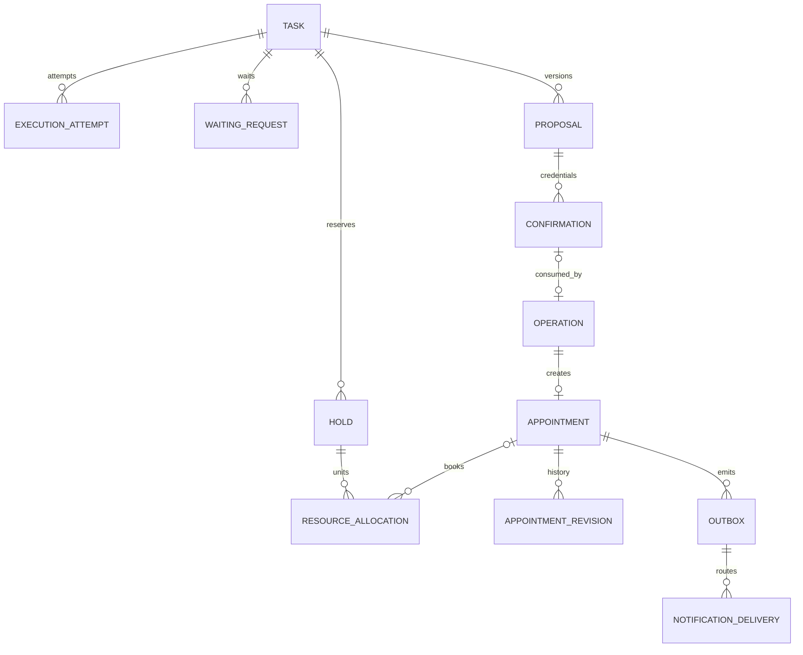

# 智能预约 Agent：数据契约与库表设计

本文是[系统设计稿](./智能预约Agent系统设计.md)的字段级补充。它定义目标设计，不代表项目已经实现这些表、迁移、接口或测试。首版范围是本地数据库内预约，不含支付退款与外部平台预约 Saga；引入这些能力时必须增加独立资金账本或外部操作账本，不能复用 notification_delivery。

## 1. 统一约定与可信边界

| 项目 | 契约 |
|---|---|
| 标识 | 内部主键 UUID；供应商 ID、幂等键、IdP subject 用文本，不强行转 UUID。客户端消息 ID 为 UUID。 |
| 租户隔离 | 除平台级 release 外，业务表 tenant_id 必填。单列 id 为主键，同时建立 UNIQUE(tenant_id,id)，跨表引用使用组合外键 (tenant_id,引用id)，防止串租户。租户、门店与对象归属仍须在领域服务校验。 |
| 时间 | instant 用 timestamptz；日期用 date；门店时区用 IANA 名称 text。预约区间为 [start_at,end_at)，start_at < end_at；实际时长为经过分钟数。日历本地时间需显式处理 DST。 |
| 金额 | amount_minor bigint ≥ 0，currency 为受支持货币代码，currency_exponent 按货币规则确定；所有快照包含这三项，禁止浮点金额与跨币种相加。 |
| 必填/空值 | 下文字段默认 NOT NULL；标记 `?` 为可空。缺省、null、空字符串不互换。请求必填字段缺失/非法 null 拒绝；Patch 的空值操作见 §2。 |
| 公共审计 | 每个可变业务聚合带 created_at、updated_at:timestamptz；version:bigint ≥ 1。不可变记录只带 created_at，修订用新记录。所有外部写入带 request_id、可信 actor 与审计关联。 |
| 默认类型 | id/内部引用为 UUID，version/epoch/fencing_token/sequence 为 bigint，状态/动作/哈希/外部引用为受限 text，时间点为 timestamptz，计数为非负 int，快照为 jsonb；字段组中的 `provider_account_id` 是供应商账户配置引用而非租户自报值。长度上限在实际接口 Schema/迁移中确定。 |
| JSON | 用于版本化快照、槽位、变长规则和诊断。身份、状态、金额、时效、关联键等参与授权/约束/查询的字段单独建列。JSON 与列值由服务端同时生成并校验一致，不接受两份冲突输入。 |
| 版本 | schema_version 为契约版本；release_id 为运行配置版本；task.version 为业务乐观锁；epoch 为任务控制权代际；fencing_token 为租约领取代际。四者不能相互代替。 |
| 调用上下文 | tenant_id、actor_id、role/store scopes、epoch、fencing_token、release_id、prompt_profile 和 structured_schema_version 由服务端绑定；模型不能通过工具参数授予权限或选择 Profile。API 请求版本、模型输出 Schema、存储快照版本分别管理。 |

写接口对未知字段拒绝，防止误拼字段被静默忽略；消费者可忽略响应新增的非关键字段。关键枚举新增、金额或时间语义改变采用新契约版本。SDK 原始 Msg/AgentState/Event 不作为对外协议。

模型费用与预约售价采用不同精度：下文 task/model_call 的成本字段使用 bigint 计费单位，cost_quantum:numeric 表示每单位对应多少预算币种（例如 0.000000001 个 USD），而非客户售价的“分”。币种和 quantum 必须相同才允许合计，预留向上取整，价格计算采用十进制定点；最终账单单独核对，避免每次微小调用按分取整为0。

## 2. 输入、输出与事件契约

### 2.1 消息与槽位

消息提交输入：conversation_id、client_message_id、content、schema_version；task_id?、waiting_request_id?、expected_task_version?。content 是受限文本或允许的附件引用，不接收可执行工具对象。服务端保存可信 actor、received_at 与内容哈希，UNIQUE(tenant_id,conversation_id,client_message_id) 去重；同键异内容返回 IDEMPOTENCY_MISMATCH。回复包含 message_id、task_id、task_version、processing_status。HTTP 受理成功不等于预约成功。

模型只提出路由建议或槽位 Patch，服务端先校验路由，再按 Profile 选择对应的 Schema 和工具；领域服务最终校验后才写 task.slots：

| 字段 | 类型与含义 |
|---|---|
| slot_name | 允许枚举：store/service/time_window/resource_preference 等；不允许任意对象路径 |
| op | SET / CLEAR / NO_PREFERENCE；未出现该槽位表示不修改 |
| value | SET 时必填且符合槽位 Schema；其他 op 不携带 value |
| evidence_message_id | 当前任务有权读取的消息 ID；不能凭空提供其他用户消息 |
| resolution_status | RESOLVED / AMBIGUOUS / UNRESOLVED；歧义候选不能冒充已确定值 |
| original_text / candidates | 时间歧义时保存原文与候选；解析附 reference_instant、semantic_timezone、locale、parser_version |

持久槽位记录 value?、source_message_id、resolution_status、intent（VALUE/CLEARED/NO_PREFERENCE）、updated_at。CLEAR 是明确撤销，NO_PREFERENCE 是可由系统选择，不是缺失。“不要小王”必须撤销旧偏好。金额、确认与订单状态不从 slots 或摘要读取。

路由轮次不开放业务工具，只输出经过 Schema 约束的 `route_result`：`primary_intent`、`secondary_intents`、`route_type`（CURRENT_TASK/WAITING_ANSWER/NEW_TASK/MULTI_INTENT/UNKNOWN）、可选的不透明 `target_task_ref`、置信度和原因码。路由结果不能创建任务、改变权限或直接执行动作；多意图由服务端校验后生成受控 `turn_plan`。

意图专用 Agent 轮次输出：schema_version、profile_id（由服务端绑定，不接受模型自报）、task_id、observed_task_version、slot_patches、next_action、clarification_question?、candidate_refs、evidence_refs、user_visible_text。`booking-slot-v1` 只允许预约字段，`modify-slot-v1` 和 `cancel-slot-v1` 使用动作专用字段，`consult-understand-v1` 只返回答案与 evidence_refs。`next_action` 只能是允许的流程动作；`clarification_question` 包含字段与允许答案 Schema，不携带授权决定。模型输出 proposal 引用或文案建议，真实方案由领域服务生成。

服务端把 `BASE_AGENT_PROMPT + PROFILE_POLICY + OUTPUT_SCHEMA` 作为 system prompt，把最小安全任务投影、标记为不可信的用户消息、筛选后的证据和已完成动作作为结构化 user content。上一个阶段的输出必须先经过字段白名单和 Schema 校验，再作为下一个阶段的 DTO；不能把原始模型文本、知识文档或用户指令拼进下一个 system prompt。模型不能选择 Profile 或扩大 `allowed_tools`，工具集合由服务端按 role、task state、Profile 和可信权限重新计算。

Profile 的正式映射如下：

| profile | 主要输入字段 | 输出与工具约束 |
|---|---|---|
| `reception-route-v1` | 当前消息、活动任务最小摘要、开放等待类型、可选不透明任务引用 | 只输出 `route_result`；不开放业务工具 |
| `booking-slot-v1` | service、time_window、duration、budget、resource_preference、服务端候选引用 | 只输出预约槽位 Patch/缺口/追问；查询工具须经服务端状态门控 |
| `modify-slot-v1` | appointment_ref、待修改字段、新时间/服务/资源偏好 | 只输出改约目标和字段；不直接执行改约 |
| `cancel-slot-v1` | appointment_ref、取消原因和规则所需字段 | 只输出取消目标/原因；不把自然语言回答当作授权 |
| `clarification-answer-v1` | question_id/version、input_schema、missing_slots、当前有效槽位和本次回答 | 只在等待 OPEN 且未过期时提取回答 |
| `consult-understand-v1` | question、门店/知识范围、服务端筛选 evidence | 只读回答和 evidence_refs |
| `handoff-v1` | handoff_reason、紧急程度和可展示摘要 | 由服务端创建/更新人工工单 |

`route_result`、`slot_patches`、咨询结果和 `turn_plan` 都是不可信的模型建议，必须在服务端校验后才能进入下一阶段；服务端不接收模型自报的 profile、工具集合、身份、权限、订单 ID、confirmation token 或幂等键。

### 2.2 工具结果与九个业务工具

统一结果：status = OK / PENDING / ERROR / UNKNOWN，data?、error_code?、retryable:boolean、operation_id?、observed_at、schema_version、request_id。OK 必须符合工具 data Schema；ERROR 必有错误码；UNKNOWN 是效果未查清，不是普通可重试失败。retryable 仅允许按指定策略重试，写操作永远复用原键。未创建 operation 的校验失败可没有 operation_id。

| 工具 | 输入业务字段（不含可信上下文） | 成功 data 必需字段 |
|---|---|---|
| search_knowledge | query、store_id?、as_of、top_k（受限） | hits[]：evidence_id、document_id、chunk_id、excerpt、source、document_version、scope、valid_from/to；无结果与依赖失败分开 |
| get_service_quote | store_id、service_id、service_version?、quantity（首版固定1）、requested_start_at? | quote_id、quote_version、service_version、duration_minutes、amount_minor、currency、currency_exponent、valid_until、terms_hash、lock_policy、quote_token（服务端保护的报价数据） |
| search_availability | store_id、service_id、time_window、resource_preferences、limit；reschedule_target_id? | candidates[]：candidate_id、资源单元列表、start/end、约束说明、dependency_versions；snapshot_at、guarantee=NONE。候选 ID 不能当占位凭据 |
| get_appointment | appointment_id | authoritative_status、fulfillment_status、version、store/service/resource/time/amount 快照、last_operation_id |
| create_hold | task_id、expected_task_version、candidate_id 或校验后的候选数据、quote_id、quote_token、idempotency_key | hold_id、expires_at、allocations[]、proposal_id/version、proposal_hash、task_version；只有事务成功才能说“已保留” |
| confirm_appointment | proposal_id/version、confirmation_token、idempotency_key、expected_task_version | appointment_id、committed_status、appointment_version、operation_id、task_version |
| reschedule_appointment | appointment_id、expected_appointment_version、proposal_id/version、confirmation_token、idempotency_key | appointment_id、最新时间资源快照、appointment_version、operation_id；失败保留旧单 |
| cancel_appointment | appointment_id、expected_appointment_version、proposal_id/version、confirmation_token、idempotency_key、reason_code | appointment_id、committed_status=CANCELLED、appointment_version、released_allocation_ids、operation_id |
| transfer_to_human | task_id、expected_task_version、reason_code、summary_ref、idempotency_key | case_id、handoff_status、task_version、epoch；不能仅回复“已转人工”而没有工单 |

get_service_quote 只读已发布价目版本，不立即写 quote 表：生成服务端签名的短期报价数据，绑定 quote_id、客户/门店/服务、价格版本、金额与有效期。create_hold 或无占位方案发布在短事务中验证该数据及撤销状态，再保存不可变 quote 快照；若相同 quote_id 已存在必须逐字段一致。签名实现采用成熟库且密钥不暴露给模型。咨询展示价格不等于已经锁价；真正锁价从方案事务成功起成立，截止沿用报价有效期。candidate 的资源、技能、班次与门店由服务端重新校验。取消方案可没有新资源/hold，但须包含原订单版本、取消规则与费用条款快照。

错误码沿用主稿：VALIDATION_ERROR、PERMISSION_DENIED、NOT_FOUND、SLOT_CONFLICT、HOLD_EXPIRED、STALE_PROPOSAL、WAITING_EXPIRED、VERSION_CONFLICT、IDEMPOTENCY_MISMATCH、DEPENDENCY_UNAVAILABLE、UNKNOWN_OUTCOME、CONFIRMATION_REQUIRED、RATE_LIMITED、HUMAN_TAKEOVER_ACTIVE、LEASE_LOST。`WAITING_EXPIRED` 表示澄清/用户等待请求过期，`HOLD_EXPIRED` 表示资源占位或方案确认过期；两者不能混用。对象无权访问可统一 NOT_FOUND；错误详情不暴露其他客户占用信息。

### 2.3 等待、确认、查单与 SSE

| 契约 | 必需字段与裁决规则 |
|---|---|
| 普通问题回答 | waiting_request_id、answer_event_id、question_version、answer、schema_version；按 stored input_schema 校验。主体、epoch、OPEN 和期限有效才合入任务；期限失效时在同一事务内完成 OPEN→EXPIRED、WAITING_USER→NEEDS_REPLAN，记录 REJECTED_EXPIRED 并返回 WAITING_EXPIRED。AskUser 答案使用此通道，不能生成 confirmation。 |
| 专用确认 | proposal_id/version、opaque_token、client_confirmation_event_id、expected_task_version、idempotency_key；服务端绑定 actor/task/action/hash。纯文本“好”仅在可信应用能唯一关联有效方案时映射，否则追问；模型不能替代该校验。 |
| 操作查询 | operation_id 或原作用域幂等键；鉴权读取主库，返回 operation_status、result?、failure?、next_poll_after?。查不到时先确认查询成功与完整作用域，不能从超时/副本滞后推断没有订单。 |
| SSE | event_id、task_id、sequence、task_version、type、occurred_at、schema_version、payload；UNIQUE(tenant_id,task_id,sequence)。客户端按 sequence 去重并携带恢复游标；保留窗口外返回 RESET_REQUIRED，先拉取授权任务快照再订阅。`clarification_expired` 是可订阅的业务事件。 |

文本流分片可走单独短期游标，不必让每个 token 增加 task.version。proposal_published / appointment_committed / proposal_invalidated / clarification_expired / handoff_changed 是持久业务事件，由事务产生；reply_end 只说明一次执行结束。恢复时新建 execution_attempt/reply，不能喂回旧 SDK park。需要幂等的事件使用稳定 `event_key`（例如 `clarification_expired:{waiting_request_id}`），不能用每次重试新生成的 UUID 判断去重。

## 3. 身份、配置与可履约事实表

各表采用 §1 公共列与组合外键。以下是字段组设计，类型省略重复公共字段；文本状态使用受控枚举/约束，不允许随意字符串。

| 表 | 字段组 | 键、约束与查询索引 |
|---|---|---|
| tenant / store | tenant：id、name、status；store：id、tenant_id、name、timezone、status、calendar_version:bigint | store 归属 tenant；索引(tenant_id,status)。timezone 经服务端 IANA 校验，不能靠普通 SQL CHECK 验完整时区库 |
| actor / identity_binding | actor：id、tenant_id、status；binding：id、actor_id、issuer、subject、verified_at | UNIQUE(tenant_id,issuer,subject)；IdP issuer/subject 的组合才是身份；手机号不是 subject |
| customer / staff_membership | customer：id、actor_id、protected_contact_ref?、status；membership：id、actor_id、store_id、role、status、version | customer.actor_id 在租户内唯一；membership UNIQUE(tenant_id,actor_id,store_id,role)。跨门店范围由受控角色策略判定 |
| service_catalog / service_version | catalog：id、store_id、status、current_version_id?；version：id、service_id、revision、duration_minutes:int、requirements:jsonb、terms_hash、valid_from、valid_to? | UNIQUE(tenant_id,service_id,revision)；时长>0；服务版本不可变。requirements 含技能、资源类型与数量，分配前逐项验证 |
| price_version | id、store_id、service_version_id、revision、amount_minor、currency、currency_exponent、terms_snapshot:jsonb、valid_from、valid_to?、revoked_at? | UNIQUE(tenant_id,store_id,service_version_id,revision)；价格内容不可变，发布/撤销走管理命令，普通新版本不撤销已保存 quote |
| quote | id、store_id、customer_id、service_version_id、price_version_id、quote_version、duration_minutes、amount_minor、currency、currency_exponent、terms_snapshot:jsonb、terms_hash、valid_until、revoked_at? | 金额≥0；UNIQUE(tenant_id,id,quote_version)；索引(tenant_id,customer_id,valid_until)。保存于方案/占位事务，发布新价不改旧 quote；撤销使用显式审计命令 |
| resource / resource_skill | resource：id、store_id、type、unit_code、status、version；skill：resource_id、skill_code、valid_from/to? | 一个 resource 是容量为1的可分配单元；UNIQUE(tenant_id,store_id,unit_code)。数量型设备拆单元，首版不使用“同资源多容量”绕过排他约束 |
| business_calendar / calendar_exception | calendar：id、store_id、revision、weekly_windows:jsonb、effective_from/to；exception：id、store_id、local_date、kind、windows:jsonb、reason、version | 索引(tenant_id,store_id,local_date)；窗口语义由校验器检查。闭店与修改共享门店规则锁，不能只修改 JSON 然后异步才禁止预约 |
| shift / resource_absence | shift：id、resource_id、start_at、end_at、status、version；absence：id、resource_id、start_at、end_at、approval_status、version、reason | 区间合法；索引(tenant_id,resource_id,start_at)。申请请假不改变可用性；批准与预约提交共享规则/资源锁 |
| resource_day_guard / customer_hold_guard | resource guard：resource_id、local_date；customer guard：customer_id | 分别 PK(tenant_id,resource_id,local_date)、PK(tenant_id,customer_id)。作为可锁定互斥行，不是占用事实。跨午夜逐日覆盖，天数受请求限制 |

门店、服务、资源必须属于同一允许门店，不仅同租户。能表达的关系用额外 UNIQUE(tenant_id,store_id,id) 与组合外键约束；动态技能、班次覆盖、规则有效期由同事务领域校验。service_catalog.current_version_id 可先为空创建 catalog，再在发布事务绑定合法版本，不把循环外键当初始化顺序的魔法。

## 4. 会话、任务与恢复表

| 表 | 核心字段与类型 | 约束/索引/权威 |
|---|---|---|
| conversation | id、tenant_id、customer_id、status、next_message_sequence:bigint | 索引(tenant_id,customer_id,updated_at,id)；对多参与者场景另建成员表，首版不把任意 actor 加入会话 |
| message | id、conversation_id、actor_id、client_message_id、sequence:bigint、content_ref/text、content_hash、received_at | UNIQUE(tenant_id,conversation_id,client_message_id) 与 UNIQUE(tenant_id,conversation_id,sequence)；单调 sequence 在会话锁内分配 |
| release_manifest | id、schema_version、manifest:jsonb、manifest_hash、status、compatible_from:jsonb | 平台级不可变配置，包含模型、Prompt Profile、输出 Schema、工具、路由/槽位策略、规则和知识版本；撤回发布不修改已存 manifest |
| task | id、conversation_id、customer_id、goal、state、slots:jsonb、slots_schema_version、version、epoch、release_id、current_proposal_id?、current_proposal_version?、clarification_attempt_count、clarification_no_progress_count、lease_owner?、lease_until?、fencing_token、budget_limit_units、settled_cost_units、reserved_cost_units、budget_currency、cost_quantum、next_event_sequence | 索引(tenant_id,conversation_id,state)、等待/可领取状态的部分索引；预算和澄清计数非负。lease_owner/until 成对为空或非空。current_proposal 两字段成对；组合 FK 关联该任务合法方案。计数跨 execution_attempt/reply 累计，恢复不能清零 |
| execution_attempt | id、task_id、release_id、epoch、fencing_token、reply_id、agent_role、prompt_profile、prompt_version、structured_schema_version、context_scope、status、started_at、ended_at?、end_reason? | UNIQUE(tenant_id,reply_id)；索引(tenant_id,task_id,started_at)。Profile 和 Schema 由服务端绑定并留痕；WAITING 后结束尝试并撤销权威，旧尝试不能写当前任务 |
| waiting_request | id、task_id、attempt_id、kind、question_id?、question_version?、attempt_no?、missing_slots?:jsonb、no_progress_count、proposal_id/version?、job_id?、task_version、epoch、release_id、input_schema:jsonb、created_at、expires_at、timeout_policy_version、status、answered_event_id?、answered_at? | kind=CLARIFICATION/CONFIRMATION/EXTERNAL；按 kind 校验所需引用；索引(tenant_id,task_id,status,expires_at)。首版每任务一个 OPEN 等待，使用部分唯一索引；切换先关闭旧请求。`expires_at` 是创建时固化的绝对截止时间，不随配置变化重算 |
| waiting_answer | id、waiting_request_id、client_event_id、actor_id、answer:jsonb、validation_status、received_at、applied_task_version? | UNIQUE(tenant_id,waiting_request_id,client_event_id)；重复异内容拒绝。validation_status 至少区分 ACCEPTED、REJECTED_STALE、REJECTED_EXPIRED、REJECTED_INVALID；过期/旧 epoch 只留审计，不能复活任务 |
| task_event | id、task_id、sequence、event_key?、task_version、type、payload:jsonb、schema_version、occurred_at | UNIQUE(tenant_id,task_id,sequence)；非空 `event_key` 在租户内唯一，用于 Worker/回答路径重试去重；按任务序号索引。授权可见快照+业务事件是恢复依据，无需全事件溯源 |
| execution_snapshot | id、attempt_id、sdk_version、snapshot_schema_version、protected_blob_ref、captured_at | 索引(tenant_id,attempt_id,captured_at)；只诊断/上下文优化，不承担确认、占位与跨等待续跑 |
| handoff_case | id、task_id、reason_code、summary_ref、owner_actor_id?、epoch、status、claimed_at?、closed_at? | 每任务最多一个 OPEN/CLAIMED 工单的部分唯一索引；接管锁 task 并增加 epoch，自动 Agent 失权 |

task.state 沿用主稿：COLLECTING、SEARCHING、PROPOSED、WAITING_CONFIRMATION、COMMITTING、SUCCEEDED、NEEDS_REPLAN、WAITING_USER、WAITING_EXTERNAL、WAITING_RESULT、FAILED、CANCELLED、HUMAN_TAKEOVER。状态迁移必须在领域服务用 expected version、epoch、fence 与有效租约条件写入；普通 CHECK 只能验证枚举，不能验证“旧状态→新状态”或调用主体。普通消息修改意图会增加 version，控制权变化才增加 epoch；每次租约接管增加 fence。澄清超时允许 WAITING_USER→NEEDS_REPLAN，必须与 waiting_request 的 OPEN→EXPIRED 和 `clarification_expired` 在同一事务内完成。

waiting_request.status=OPEN/ANSWERED/EXPIRED/SUPERSEDED；CONFIRMATION 对应任务 WAITING_CONFIRMATION，CLARIFICATION 对应 WAITING_USER，EXTERNAL 对应 WAITING_EXTERNAL。授权直接确认 API 没有 SDK attempt，使用自己的可信命令上下文校验 task.version/epoch；Agent/自动接管者还必须验证自身 fence 和执行权，不把前端伪造的 fence 当凭据。`clarification_expired` 只允许由 OPEN→EXPIRED 的成功事务产生，重复发现已 EXPIRED 时复用同一 event_key，不重复追加事件。

## 5. 方案、占位、确认与订单表

### 5.1 方案与资源

| 表 | 核心字段与类型 | 约束/索引 |
|---|---|---|
| proposal | id、task_id、version、action、target_appointment_id?、expected_appointment_version?、hold_id?、quote_id?、schema_version、canonical_content:jsonb、content_hash、dependency_snapshot:jsonb、expires_at、status | 同一方案修订保留(id,version)多行，PK(tenant_id,id,version)，UNIQUE(tenant_id,task_id,id,version)。另用 proposal_id 在任务内稳定标识系列；内容字段不可变，status 可变。索引(tenant_id,task_id,created_at) |
| hold | id、task_id、customer_id、store_id、quote_id、action、target_appointment_id?、state、expires_at、created_operation_id、booked_appointment_id? | state=HELD/BOOKED/RELEASED/EXPIRED；created_operation_id 唯一防重复占位。索引(tenant_id,customer_id,state)、(tenant_id,state,expires_at)。首版一个客户最多一个 HELD，部分 UNIQUE(tenant_id,customer_id) WHERE state=HELD |
| resource_allocation | id、store_id、resource_id、hold_id?、appointment_id?、start_at、end_at、state、expires_at?、version | HELD 必须 hold_id/expiry 且 appointment_id 为空；BOOKED 必须 appointment_id 且 expiry 为空。RELEASED/EXPIRED 保留原引用与历史。索引(tenant_id,hold_id)、(tenant_id,appointment_id) |
| appointment | id、customer_id、store_id、status、fulfillment_status、version、service_snapshot:jsonb、resource_snapshot:jsonb、start_at、end_at、amount_minor、currency、currency_exponent、terms_snapshot:jsonb、created_operation_id、last_operation_id、actual_start_at?、actual_end_at? | created_operation_id 唯一，last_operation_id 不唯一（不要错误限制每单只能一个操作）；索引(tenant_id,customer_id,start_at,id)、(tenant_id,store_id,start_at,status) |
| appointment_revision | id、appointment_id、version、snapshot:jsonb、operation_id、reason_code、actor_id | UNIQUE(tenant_id,appointment_id,version)；与修改事务同时写；改约/取消/履约历史不靠当前快照推测 |

proposal 是上述“默认 UUID 单列主键”约定的例外，采用方案 ID+版本复合主键；所有方案引用都必须包含 version，不可引用任意最新版本。CREATE/RESCHEDULE 的内容包括门店、服务版本、资源单元、绝对区间、金额币种、条款与目标订单版本；CANCEL 包括目标订单版本、规则与费用，不要求 hold。proposal.status=ACTIVE/SUPERSEDED/INVALIDATED/COMMITTED/EXPIRED，不能靠聊天文案决定有效性。

排他约束：同 tenant/resource 的 tstzrange(start_at,end_at,'[)') 在 state IN (HELD,BOOKED) 时禁止重叠，使用 PostgreSQL GiST 排他约束；UUID 等值需要对应支持（部署迁移检查扩展权限）。不能在索引谓词中用随时间变化的“expires_at > 当前时间”实现自动过期。查询忽略到期 HELD；写入先在锁内把有关到期 HELD 转 EXPIRED，再插入，避免旧行仍被排他约束挡住。到期不依赖清理 Worker 才能正确。

客户 HELD 唯一索引也包含“逻辑到期但未改状态”的行，故 create_hold 必须先锁 customer_hold_guard 并到期化旧 hold，然后替换。新方案发布失败，旧占位替换及方案失效也应回滚；不能先独立提交释放再尝试新占位。

appointment.status=CONFIRMED/COMPLETED/CANCELLED/NO_SHOW；fulfillment_status=READY/DISRUPTED，后者不等于取消。跨表“订单快照与全部占用一致”“所有资源数满足 requirements”由受限领域事务检查，不能声称用单行 CHECK 完成。BOOKED 历史区间仍参与排他；取消释放，完成/爽约不自动提前放号。延长实际服务必须同步处理约束资源区间，不能只写 actual_end。

### 5.2 确认与幂等

| 表 | 核心字段与类型 | 约束/索引 |
|---|---|---|
| confirmation | id、task_id、actor_id、proposal_id、proposal_version、proposal_hash、action、token_hash、nonce、expires_at、status、client_event_id?、confirmed_at?、consumed_operation_id? | token_hash 与 nonce 各自唯一；status=ISSUED/CONFIRMED/CONSUMED/INVALIDATED/EXPIRED；UNIQUE(tenant_id,actor_id,client_event_id)（非空值）。签发 token 不等于用户已确认；消费绑定一个操作 |
| operation | id、task_id?、customer_id?、actor_id、action、target_appointment_id?、idempotency_key、request_schema_version、request_hash、proposal_id/version?、confirmation_id?、status、result:jsonb?、error_code?、lease_owner/until?、fencing_token、started_at?、completed_at? | UNIQUE(tenant_id,actor_id,action,idempotency_key)；业务确认写入另有 UNIQUE(tenant_id,confirmation_id)（非空），防同一凭据换键；索引(tenant_id,status,lease_until) |
| tool_execution | id、attempt_id、tool_call_id、tool_name、tool_version、operation_id?、parameter_hash、status、result_ref?、error_code?、started_at、finished_at? | UNIQUE(tenant_id,attempt_id,tool_call_id)；SDK 调用去重不能替代 operation 业务去重 |

对 CREATE/RESCHEDULE/CANCEL 再约束 UNIQUE(tenant_id,task_id,proposal_id,proposal_version,action)（方案引用非空时），防不同 confirmation 对同一方案重复产生业务效果。动作、目标订单与方案引用必填关系按 action 校验。原方案的终态失败不会通过新键重试复活；重新规划产生新方案版本/确认。create_hold 等无 confirmation 的写命令也进入 operation，但使用自己的动作作用域，不挤占确认命令的唯一键。

request_hash 覆盖服务端规范化的动作、目标与 expected version、方案 ID/版本/哈希和其他有效业务参数；不包含 retry 次数、trace_id、原始 token、SDK reply_id 与文案。金额转最小单位、时间转绝对 instant、资源列表按稳定 ID 排序、缺省值统一后，采用约定的确定序列化计算哈希。相同键异参数必须冲突。已成功操作重复请求先验证当前身份与结果读取权限，再返回原结果；不因为已消费/已过期 token 重建一笔订单。未成功的新提交仍完整验证确认与期限。

operation.status=REGISTERED/RUNNING/SUCCEEDED/FAILED_FINAL/UNKNOWN。本地数据库事务完全回滚后，可在恢复流程以同键重试；不把一次数据库暂时不可用记成永久业务失败。UNKNOWN 保留原键并先查主库/外部证据。注册记录允许独立短事务先持久化，订单、确认消费、占用与 SUCCEEDED 结果必须同一个提交事务。跨表确认.consume 与 operation 双向关联属于同事务校验，循环引用可先空再条件更新，不在两个独立事务分别“成功”。

## 6. 异步交付、供应商证据与观测表

| 表 | 核心字段与类型 | 约束/索引 |
|---|---|---|
| outbox | id、aggregate_type/id、aggregate_version、event_type、schema_version、payload:jsonb、occurred_at、status、available_at、attempt_count、lease_owner/until?、fencing_token | UNIQUE(tenant_id,aggregate_type,aggregate_id,aggregate_version,event_type)；同版允许多个同类事件时额外加入业务 event_key；部分索引(status,available_at,id) |
| job | id、source_event_id?、task_id?、kind、logical_key、payload:jsonb、schema_version、status、next_run_at、attempt_count、max_attempts、lease_owner/until?、fencing_token、deadline_at?、last_error?、result_ref? | UNIQUE(tenant_id,kind,logical_key)；调度部分索引(status,next_run_at,id)。仅消费 outbox 的 Worker 在 job/投递已持久化后确认消费 |
| notification_delivery | id、source_event_id、appointment_id、appointment_version、channel、recipient_ref、template_version、provider、provider_account_id、provider_idempotency_key、payload_hash、payload_ref、status、last_reconcile_at?、next_reconcile_at?、reconcile_status、reconcile_result_ref?、reconcile_deadline_at、supersedes_delivery_id? | UNIQUE(tenant_id,source_event_id,channel,recipient_ref,template_version)；UNIQUE(provider,provider_account_id,provider_idempotency_key)。索引(tenant_id,appointment_id,appointment_version)、(status,next_reconcile_at) |
| delivery_attempt | id、delivery_id、attempt_number、provider、provider_account_id、request_hash、submitted_at、response_at?、provider_request_id?、provider_message_id?、status、error_code?、response_ref? | UNIQUE(tenant_id,delivery_id,attempt_number)；请求/消息 ID 未知允许 null。同一消息可能有多次重试回执，不对本表 message_id 强制唯一 |
| provider_message_binding | id、provider、provider_account_id、provider_message_id、delivery_id | UNIQUE(provider,provider_account_id,provider_message_id)；一个消息仅映射一个逻辑 delivery，作用域账户由可信配置识别，不能用 payload 自报 tenant |
| provider_receipt | id、provider、provider_account_id、provider_event_id、provider_message_id?、delivery_id?、event_type、provider_occurred_at?、received_at、validation_status、processing_status、protected_raw_ref | UNIQUE(provider,provider_account_id,provider_event_id)；tenant_id 在可信绑定前可空，此表是租户隔离例外，未绑定记录仅平台隔离处理权限可见；绑定后组合 FK。索引(processing_status,received_at) |
| model_call | id、attempt_id、task_id、reply_id、trace_id、model/version、prompt_profile、prompt_version、structured_schema_version、context_scope、model_price_version、input/output/cache_tokens?、usage_status、reserved_cost_units、estimated_cost_units?、settled_cost_units?、currency、cost_quantum、latency_ms、error_code? | usage_status=RESERVED/REPORTED/ESTIMATED/UNKNOWN；索引(tenant_id,task_id,created_at)。缺 usage 不能按0结算，成本估计口径与供应商账单区别存储；Prompt/Profile/Schema 版本用于回放和评测；model_price_version 不引用预约服务的 price_version |
| audit_event | id、actor_id、action、object_type/id、before_version?、after_version?、operation_id?、confirmation_id?、request_id、reason_code、protected_detail_ref? | 不可变；索引(tenant_id,object_type,object_id,created_at)。不得存裸 token 或未脱敏手机号 |
| disruption / disruption_item | disruption：id、store_id、reason、rule_version、status；item：id、disruption_id、appointment_id、detected_appointment_version、status、resolution_operation_id? | UNIQUE(tenant_id,disruption_id,appointment_id)；相关规则立即阻止新预约，再分批幂等处理旧订单，不持有跨人工等待长事务 |

投递状态采用主稿 PENDING/SENDING/ACCEPTED/DELIVERED/FAILED_RETRYABLE/FAILED_FINAL/UNKNOWN/SUPERSEDED。状态归并由供应商适配器验证证据，不允许通用“后到覆盖前到”。可信 DELIVERED 不被晚到 ACCEPTED 降级。若供应商无 event_id，必须规定可验证的事件去重方法与证据限制，不能假设所有供应商都有该字段。

outbox.status=PENDING/LEASED/PROCESSED/DEAD_LETTER；PROCESSED 仅说明消费者已持久受理。job.status=PENDING/RUNNING/SUCCEEDED/FAILED_RETRYABLE/FAILED_FINAL/UNKNOWN/CANCELLED，UNKNOWN 必须按该 job 的业务类别查证，不能由调度器统一重跑。attempt_count/max_attempts 限制重试，deadline_at 限制总等待；达到截止产生告警/人工待办，不把未知副作用改成失败事实。

调用前持久化 attempt；回调先到、暂时无法映射时 provider_receipt 为 QUARANTINED，建立 provider_message_binding 后重处理。UNKNOWN 优先查单，不盲重发。provider_account 配置需维护幂等支持/有效窗口、查单支持、回执语义、限流和签名密钥引用；密钥保存在专用秘密管理位置，非普通 JSON/日志。

知识与偏好辅助表：knowledge_document(id,tenant_id,store_scope,version,source,valid_from/to,ACL,status)、knowledge_chunk(id,document_id,document_version,text_ref,embedding,embedding_model/version)、preference(id,customer_id,key,value,source_kind,evidence_id,explicit,expires_at)。知识版本与 embedding 模型版本不可混用；召回必须在授权范围过滤。评测 eval_case/eval_run/annotation 使用独立评测库或 Git，不参与预约事务。

## 7. 事务边界与锁顺序

SQL 唯一键、外键、区间排他只能解决部分不变量。普通读后检查无法阻止规则变更；所有入口（Agent、表单、员工与 Worker）共享同一领域服务及锁协议。

规定锁层次：任务（同批按 ID）→ 客户占位 guard（按 ID）→ 门店规则 guard（锁 store 行，按门店 ID）→ 资源/服务规则 guard（锁 resource/service_catalog 行，按类型+ID）→ 资源日 guard（按 resource_id+local_date）→ 订单（按 ID）→ quote/hold/方案/确认/operation（各类固定顺序）。规则子表写入同样先锁对应父行，不能绕过 guard。持锁后禁止反向补拿上层锁；先读取关系确定集合，再按顺序加锁并重读版本，关系变化则回滚重试。集合包括旧占位到期/替换涉及的全部资源，不能只锁新候选。管理命令若需要更高层 task 锁，须重新按完整协议开始，不能锁完资源再锁 task。依赖规则只读可共享锁，规则写入独占；最终冲突由排他约束兜底。

| 事务 | 必须一起提交 | 回滚/恢复规则 |
|---|---|---|
| 接收消息/答案 | 消息去重或答案去重、task 条件更新、必要的旧等待/方案失效、task_event/调度 job | 并发消息 version 冲突后重读；答案路径在锁内用数据库实际时间检查 waiting_request 的 `expires_at`，过期则原子标记 EXPIRED、推进 task、写 `clarification_expired` 并返回 WAITING_EXPIRED；旧 epoch 答案不改变任务。只普通咨询可以不作废预约方案，按实际意图区分 |
| create_hold | 注册原键、锁配额与资源、到期化旧占位、验证班次/技能/报价、hold+全部 allocation、proposal、task 版本/事件、operation 结果 | 任一资源失败则全部回滚；到期判断使用拿锁后的数据库实际时钟，不用事务开始时间；不在事务中调模型或供应商 |
| 发布等待 | waiting_request、task 等待状态、持久事件；必要外部 job | 提交后才展示问题；当前 attempt 失权。回复流关闭失败也不能继续带旧权限提交 |
| 过期澄清 | waiting_request、task 状态、`clarification_expired` task_event、必要通知/监控 job | Worker 和用户回答路径共用 OPEN 条件与稳定 event_key；只有一方能完成 OPEN→EXPIRED。Worker 挂掉不影响回答路径最终拒绝过期答案 |
| 接受可信确认 | 锁方案/确认/任务，验证展示绑定与主体，ISSUED→CONFIRMED，记录 client event | 普通问题答案不走此事务。可与下面提交合成一个短事务，避免多一个状态窗口 |
| confirm | 固定原键、task epoch/version/fence、有效方案/quote/hold 与依赖校验、confirmation→CONSUMED、hold→BOOKED、allocation→BOOKED、appointment/revision、operation→SUCCEEDED、outbox、task_event | 响应丢失查原 operation；订单成功不会因 SDK 或通知失败回滚。多资源只能全部成功 |
| reschedule | 校验原订单 version、新方案确认；原占用变更/释放和新占用、订单 version/revision、operation、outbox、task_event | 重叠自身可在事务内替换占用，冲突回滚保留旧单。无新 hold 的方案明确 guarantee=NONE，不能假称确认前已保证 |
| cancel/complete/no-show | 订单条件迁移、revision、相应占用策略、operation、outbox、audit | 取消释放；完成/爽约保持原计划区间，独立提前放号命令改变剩余资源区间；非法终态更改拒绝 |
| 闭店/批准请假 | 规则版本变更、阻止新预约、受影响未提交方案的失效依据、disruption/outbox、audit | 大批量订单分批处理；旧方案即使尚未被扫描标 INVALIDATED，提交依赖校验也必须拒绝。已确认订单不静默取消 |
| Worker 领取/提交 | 条件领取增加 fence；结果提交校验本次 fence、租约与业务版本 | 外部调用不持长数据库事务。DB fence 不能撤回已发出的外部请求，需供应商幂等/对账 |

管理请求通用字段为 command_id/idempotency_key、expected_version、reason_code、有效区间及命令专有字段；actor/store scopes 可信注入。complete 额外 actual_start/end 与 evidence_ref；no-show 额外 policy_version 与 evidence_ref，要求开约+宽限期且未签到/开始。更正终态走专用授权命令，不允许任意 PATCH status。

严格任务预算：调用前锁 task，检查 settled+reserved+新预留 ≤ limit，写 model_call 预留；结算按同事务扣旧预留与加结算。并发咨询与重试共享预算。预留是政策上界/估算，若供应商费用无法严格预知，不能声称数据库余额本身保证实际账单绝不超预算。

## 8. 核心关系图与设计验收

图仅表示核心关系；proposal/confirmation 关联含方案版本，operation 还可修改已有订单；一笔订单可有很多操作，不是图中“creates”关系的反向限制。allocation 从 HELD 到 BOOKED 保留 hold_id 来源，BOOKED 时新增 appointment_id，hold 对订单最多一个。图不代替约束表。

| 不变量 | 主要落实位置 | 必须验证的反例 |
|---|---|---|
| 不串租户 | 组合 FK + 可信身份/对象授权 + 回执账户映射 | 同 id 不同租户、模型改 tenant、伪造回调 tenant |
| 不超卖 | 排他约束 + 资源规则锁 + 全部资源单事务 | 同号并发、部分资源成功、过期占位未由 Worker 处理 |
| 不重复业务效果 | operation/confirmation/方案动作唯一键 + 请求哈希 | 同键异参数、换键重复确认、提交成功响应丢失 |
| 不越权确认 | token 绑定 + 服务端确认事件 + 原子消费 | AskUser“批准”、SDK ASK、旧版本/旧 epoch、转发 token |
| 旧执行器不能写 | task version/epoch/fence 与租约条件提交 | 新消息/人工接管后旧模型或旧 Worker 恢复 |
| 改约失败保旧单 | 原订单与替换占用同事务 | 新资源冲突、重叠自身、操作响应丢失 |
| 通知不冒充送达 | delivery/attempt/receipt 分层 + 签名/去重/对账 | HTTP200无送达、回调先到、乱序、账户 ID 碰撞 |

这些是待实现验收契约，不是已跑测试的成绩。P0 必需：身份、可履约事实、会话任务、方案占位确认订单、operation、outbox/job、基础投递与审计；没有真实通知时可不配置供应商，但不能展示虚假发送成功。首版“每客户最多一个有效占位”是明确配额政策，不是通用预约系统必然要求，未来修改需同步 guard 与唯一键设计。P1 再启用自动租约接管、供应商对账、严格并发预算与完整评测平台；P0 仍保留版本/幂等/排他，不能为简化而拿掉正确性。P2 才根据测量增加专用 RAG、多 Agent 拆分、外部平台 Saga。

上线前还需将本文转换为实际迁移与接口 Schema，并校验 PostgreSQL 扩展权限、索引计划、字段长度上限、数据保护/保留策略、供应商真实能力、锁协议与场景测试。诊断快照可按受控保留策略归档；订单、确认及最小防重证据的保留覆盖生命周期和允许重试窗口，不能短 TTL 后令旧授权重新生效。本文未执行任何删除或清理操作。

数据库能力依据：[PostgreSQL 范围与排他约束](https://www.postgresql.org/docs/15/rangetypes.html)、[btree_gist 支持 UUID](https://www.postgresql.org/docs/15/btree-gist.html)、[索引表达式及谓词的 immutable 要求](https://www.postgresql.org/docs/15/sql-createindex.html)。这些文档支持数据库机制，不证明本文业务事务已正确实现。
