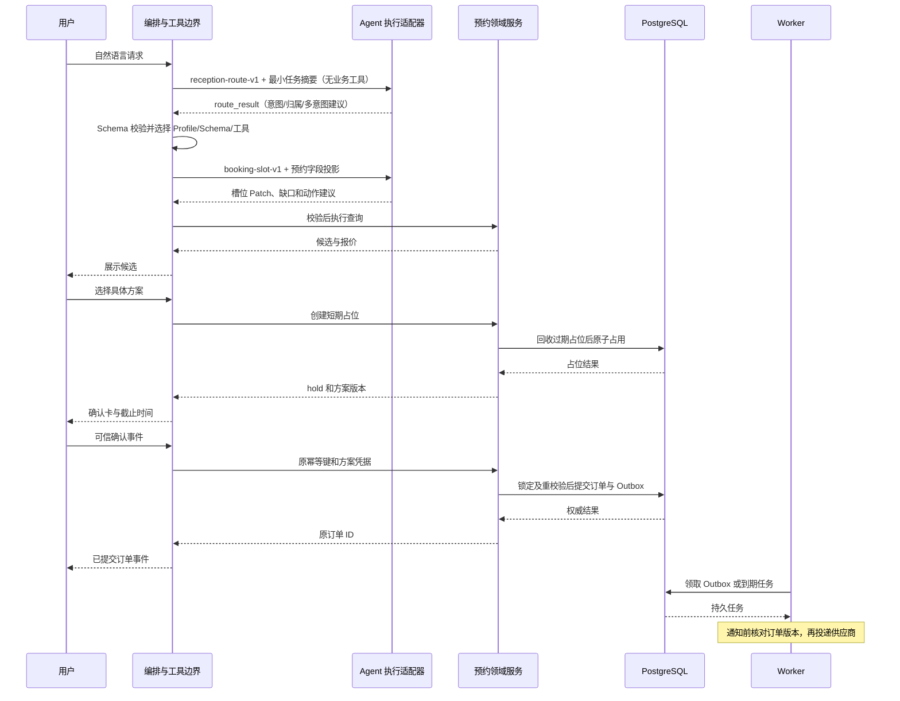
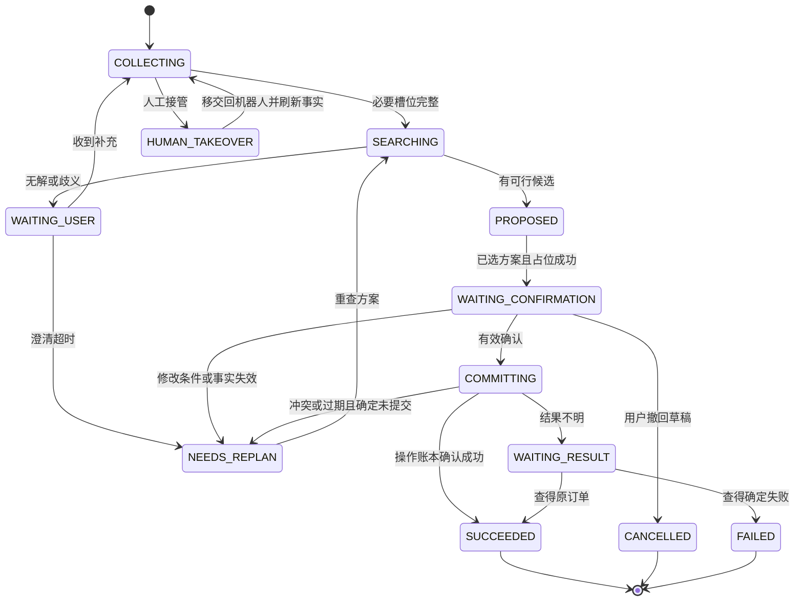
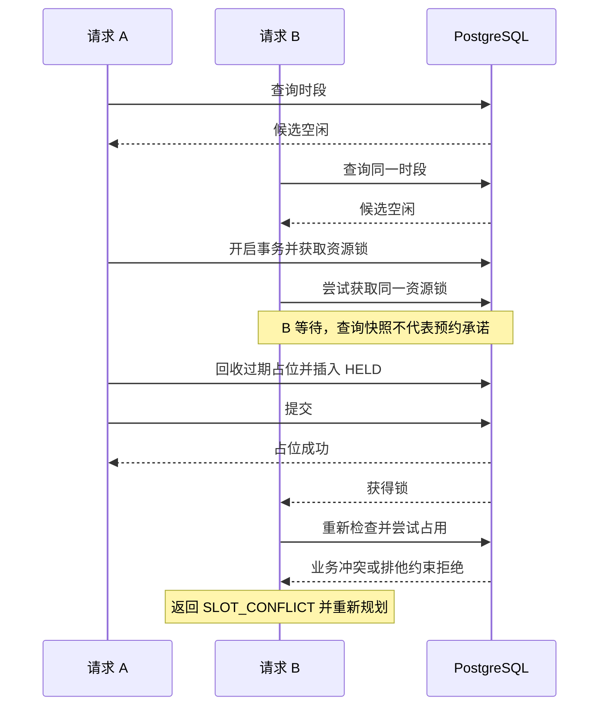

# 智能预约 Agent 系统设计与面试答辩稿

设计日期：2026-09-17；评审修订版 v3.3（R1–R5、数据契约、澄清等待与渐进式披露补充）。本文是目标架构与验证计划，没有实现、上线或压测结果。容量、阈值和指标均为设计假设或建议验收目标。架构图见同目录 appointment-architecture.html；字段级设计见[数据契约与库表设计](./数据契约与库表设计.md)。

核验基线：[已验证] AgentScope commit `033a3613401a3e6cbd39608321579481f6bd0953`；预约原型 commit `2bd2dba67e46bf65d614ca7917d0005a45c6a25e`。本次用 `git show commit:path` 核对固定版本，排除本地未提交改动。能力证据见 §17 与同目录 source-verification.json。

阅读标记：[已验证] 表示有固定源码或官方文档证据；[设计] 表示本文方案，尚未实现；[待测量] 表示参数、容量或质量假设。除明确标为已验证的外部能力外，全文的系统行为均为设计，指标均待测量。

目录：[决策](#1-决策摘要) · [来源与取舍](#2-对原项目的核验与取舍) · [边界与容量](#3-系统边界和不变量) · [架构](#4-架构与各层职责) · [Agent 与 SDK 映射](#5-两个在线-agent-角色与渐进式披露) · [渐进式披露](#5.1.1-渐进式披露与上下文隔离) · [澄清与等待](#5.6-澄清无进展与等待超时) · [数据和状态](#6-数据模型和状态管理) · [执行链路](#7-一条完整的执行链路) · [事务](#8-并发幂等确认与改约) · [工具](#9-工具契约与服务-api) · [RAG 与记忆](#10-rag记忆和推荐) · [恢复](#11-故障恢复与异步任务) · [安全与发布](#12-安全可观测性和部署) · [评测](#13-评测验收和消融) · [优先级](#14-实施优先级和面试证据) · [答辩](#15-面试问答) · [讲稿](#16-两分钟项目介绍模板) · [证据](#17-核验来源) · [白板图](#18-白板讲解图)

核心术语：

| 名称 | 精确定义 |
|---|---|
| task | 一次业务目标及其持久流程，可跨多轮 reply；不同于 SDK 的规划任务 |
| proposal | 向用户展示的可版本化方案；方案不等于资源保证 |
| hold | 一次有截止时间的临时资源保证，可关联多条 allocation |
| resource_allocation | 对技师、房间等单位资源的实际区间占用 |
| operation | 一个幂等业务命令及结果；同一次确认的重试复用它 |
| confirmation | 可信用户事件对具体动作和方案内容的授权证据 |
| reply | SDK 的一次回答执行，可因 HITL 暂停；不等于整个业务 task |
| Prompt Profile | 由服务端按流程阶段选择的版本化 Prompt、输出 Schema、上下文投影和工具策略组合 |
| route_result | 路由模型提出的意图、任务归属和多意图建议；不具备权限或状态迁移能力 |
| turn_plan | 服务端根据已校验 route_result 生成的受控步骤计划；不是模型可自由创建的任务列表 |

## 1. 决策摘要

采用 smart-appointment-ai-agent 的门店业务闭环与分层思想，以 AgentScope 2.0 的 Agent 执行抽象为智能层基础，另建确定性的任务编排与预约领域服务。自然语言先经过状态门控和轻量路由，再由服务端按意图渐进式披露 Prompt、Schema、上下文和工具；核心原则：模型理解需求、选择允许的查询、提出方案；业务服务验证权限与约束；数据库裁决资源占用；用户确认绑定具体方案。

第一版采用模块化单体：FastAPI + AgentScope SDK + PostgreSQL（业务数据及 pgvector）+ 独立 Worker。Redis 仅在需要共享限流、短期缓存时引入；没有 Redis 也必须能保证预约正确。首版只做 Web，使用 SDK 嵌入模式与成熟身份组件；不同时运行第二套 Agent Service 会话入口。§4.1 对完整 Agent Service 的复用收益与不采用部分逐项说明。

场景选择连锁到店服务，以按摩门店为例，可映射到美容、健身私教等。完成服务咨询、自然语言预约、替代方案、查询、改约、取消、提醒、人工接管。首版默认单个服务、单位容量资源、门店本地时区，不接支付、医疗诊断、跨企业预约或自主营销。

## 2. 对原项目的核验与取舍

[已验证] 本次进一步核验两个固定 commit 的源码，未运行原项目，也没有完成全仓审计。本地 AgentScope 有大量未提交变更；清单中的 `_jwt.py`、`_jwks.py`、`_auth.py` 是未跟踪文件，不属于所列 commit。该 commit 的 `app/deps.py:33–55` 使用临时 `X-User-ID` 头身份，不能直接视为生产 JWT 认证。

| 来源 | 借鉴 | 本方案的调整 |
|---|---|---|
| smart-appointment-ai-agent | 门店场景；咨询、预约、偏好分工；Agent→Service→Repository 分层 | 保留业务边界，重新设计事务、身份、持久任务与授权 |
| AgentScope | Agent 执行、结构化输出、Toolkit、模型适配、事件、中间件、权限与人工介入 | 嵌入 SDK；具体业务确认和数据权限仍由领域服务校验 |
| 原型中的个性化推荐 | 利用用户显式偏好和预约历史 | 先采用可解释规则；分析异步运行，不阻塞预约 |
| 原型中的天气提示 | 外部信息可改善体验 | 降为可选增强，失败时省略天气；不制造默认事实 |

原型的两个具体工程问题：

1. `is_technician_available` 与 `add_schedule` 各自开启数据库会话，写入函数没有同时执行区间排他约束；检查与写入之间存在竞争窗口。其模型文件也未声明时间区间排他约束。固定版本中 `add_schedule:154–179` 与 `is_technician_available:204–224` 分别创建会话，`TechnicianSchedule:17–25` 未声明区间排他约束。这证明存在可构造的重复占用执行顺序，不能保证并发不冲突；不代表每次并发都必然成功，调度、SQLite 锁竞争和异常仍影响结果。[排班仓库](https://github.com/jerry-ai-dev/smart-appointment-ai-agent/blob/2bd2dba67e46bf65d614ca7917d0005a45c6a25e/db/repositories/technician_repository.py)；[模型定义](https://github.com/jerry-ai-dev/smart-appointment-ai-agent/blob/2bd2dba67e46bf65d614ca7917d0005a45c6a25e/db/models.py)。
2. `WeatherMCPTool` 在缺少密钥或请求失败时返回预设天气；该类实际通过 aiohttp 调 HTTP API，类名含 MCP 并不能证明使用了 MCP 协议。本方案要求外部返回值携带状态与来源。[预约处理器](https://github.com/jerry-ai-dev/smart-appointment-ai-agent/blob/2bd2dba67e46bf65d614ca7917d0005a45c6a25e/agents/appointment/appointment_processor.py)。

原型预约 Agent 使用内存历史和字典维护槽位，适合验证多轮流程；本方案将关键任务状态持久化，进程重启后依旧可恢复。[预约 Agent](https://github.com/jerry-ai-dev/smart-appointment-ai-agent/blob/2bd2dba67e46bf65d614ca7917d0005a45c6a25e/agents/appointment_agent.py)。

版本边界：检索时 AgentScope 主线 README 已介绍 2.0，示例入口为 `Agent`，并提供 Toolkit、事件及中间件等组件。早期 1.x 文档中的 ReActAgent、Memory、MsgHub 等名称不能未经核对混用于 2.0。实现时应锁定经验证的发布版本、提交与依赖文件，本文只描述已核验能力和应用层契约，不声称提供可直接运行的 SDK 接口。[AgentScope 主仓库](https://github.com/agentscope-ai/agentscope/tree/033a3613401a3e6cbd39608321579481f6bd0953)。

[已验证] 原型 `save_appointment:25–46` 用毫秒时间戳作为关联 ID，写排班后返回布尔值；所核验 models.py 未定义独立 Appointment 聚合。因此本文的 appointment / resource_allocation / operation 是结构性重建，不是替换框架即可获得的能力。

[设计] 贡献边界：开源项目提供业务启发和执行框架；本文新增业务确认协议、依赖事实校验、资源事务模型、幂等恢复和验证方案。代价是更多领域代码、持久状态与测试工作。保留原型的服务目录、语义解析和分层经验，重建事务路径；不把尚未完成的迁移或改进称为个人已实现成果。

## 3. 系统边界和不变量

### 3.1 系统必须保证什么

- 同一租户中的同一单位容量资源，不能存在时间重叠的有效占用。
- 确认只作用于用户实际看到且同意的方案版本。
- 同一业务命令重复送达，只产生一次业务效果。
- 预约状态由业务数据库决定，模型回答、缓存和聊天摘要均不能改变事实。
- 用户、门店员工和后台任务都经过同一预约领域服务，不能绕过约束写排班。
- 候选查询结果只是时间点快照，不构成预约承诺。
- 通知失败不把已确认预约变成失败；调用超时也不能直接推定业务失败。
- 每个业务写入都能关联操作者、确认依据、命令、任务与审计事件。

### 3.2 容量假设

用于讨论的规模：50 家门店、每店 20 名技师、每天 10,000 个会话、每会话 6 条用户消息。按 12 小时营业窗口，平均约 1.39 条消息/秒；若峰均比暂取 10，设计输入约 14 条消息/秒。若平均活跃处理时间为 5 秒，需要约 70 个并发处理位置，这是 Little 定律的估算，不是压测容量。

按每消息平均 1.5 次模型调用估算，峰值约 21 次模型调用/秒；还需根据真实输入输出 token、RPM/TPM 配额、重试比例校核模型服务能力。持久等待用户的任务不应占用活跃执行线程。数据库规模和任务负载不足以支持首版引入复杂微服务的收益。

### 3.3 连接、等待任务与 token 预算

[待测量] 容量规划应区分消息到达率、进入等待态的速率、模型调用率：

| 资源 | 示例预算与口径 |
|---|---|
| 数据库连接 | 4 个 API 进程 × 8 条池上限 + 2 个 Worker × 4 + 运维/迁移 10 = 50 条；假设应用预算 80，则留 30 条余量。上限包含 overflow，多进程逐个计数 |
| 活跃模型执行 | 前文约 70 个等待外部 I/O 的位置，不代表持有 70 个数据库连接；调用模型期间不持有事务或连接 |
| 等待用户任务 | 假设每秒 5 个任务进入等待态、平均停留 90 秒，则约 450 个；不能直接用 14 条消息/秒当任务进入率。另测试 1,500 等待任务突发和长期未回复积压 |
| 模型吞吐 | 假设峰值 21 calls/s，每次平均 2,000 输入与 300 输出 token，则约 252 万输入 TPM、37.8 万输出 TPM、1,260 RPM；预留 30% 后按供应商配额口径校核 |

任务扫描索引以 `(state, next_run_at)`、`(state, lease_until)` 与租户范围为主，分批领取，不能每秒全表扫描。等待用户采用“绝对截止时间 + 主动过期事件 + 读取/写入时最终校验”的组合：创建 waiting_request 时固化 `created_at`、`expires_at` 和 `timeout_policy_version`；Worker 负责及时将仍为 OPEN 且已到期的请求推进为 EXPIRED、写入审计事件、驱动通知与监控；用户回答路径仍必须在事务内用数据库实际时间重校验，不能因为 Worker 延迟或宕机而接受过期答案。到期任务留存历史但退出活跃索引。若连接实测成为瓶颈，再评估 PgBouncer 事务池，并检查会话设置、准备语句及租户 RLS 上下文兼容性。池上限示例不是 PostgreSQL 默认值，也不是已压测配置。

## 4. 架构与各层职责

主路径：渠道客户端 → FastAPI 接入 → 持久任务编排器 → 授权工具执行 → 领域服务 → PostgreSQL。编排器按需调用 AgentScope Agent；Agent 发出的工具请求进入同一个权限与契约边界。

| 模块 | 输入与输出 | 权责 |
|---|---|---|
| 接入层 | message_id、conversation_id、用户输入 → task_id、事件流 | 身份解析、租户绑定、限流、输入大小限制、消息去重 |
| 任务编排器 | 用户事件、路由结果、工具结果 → Profile 选择、状态迁移、下一步动作 | 槽位持久化、版本、执行租约、预算、人工等待与恢复；分离最小模型上下文与可信执行上下文；服务端生成 turn_plan 并计算有效 Schema/工具 |
| 接待 Agent | 服务端选择的路由/意图 Profile、最小任务上下文、当前消息 → 路由建议、槽位 Patch、追问、查询调用、方案解释 | 理解自然语言，协调咨询与预约；不能直接写数据库；不共享所有意图的全量字段 |
| 咨询 Agent | 问题、门店范围 → 有来源的答案或证据不足 | 检索与解释；只读权限 |
| 工具边界 | 结构化调用 → 类型化结果 | 参数、身份、对象归属、任务版本、确认凭据、超时校验；服务端注入可信字段、解析不透明引用并脱敏结果 |
| 预约领域服务 | 查询/占位/确认/改约/取消命令 → 业务结果 | 业务规则、幂等、资源约束、事务、审计与 Outbox |
| Worker | 到期任务、Outbox 事件 → 提醒、偏好候选、状态维护 | 有限重试、去重、任务租约、失败转人工 |

图中的任务/执行存储和订单/Outbox 是同一 PostgreSQL 的逻辑模块；SDK 与编排同进程。Agent 返回工具提议，再经编排与工具边界执行；Worker 通过同一业务命令入口调用领域服务，也可从数据库领取到期任务和 Outbox 后向供应商投递。SSE 是接入层向用户返回事件；人工坐席具有独立工作台。模型与知识适配在图中合并展示，实现接口分开。这是目标结构，不是两个仓库的现状拓扑。

[设计] 编排器维护两层上下文，不把所有信息原样传给 Agent。**模型上下文**只包含完成当前理解和选择所需的最小数据：当前用户消息、规范化槽位、可展示的业务事实、经过租户/权限过滤的证据、候选的不透明引用、允许的工具及其输入 Schema。**可信执行上下文**留在服务端，由接入身份、当前 task 和数据库状态组成，包括 tenant_id、actor_id、角色与范围、task/version/epoch/fencing_token、原始对象引用、报价/确认凭据、业务幂等键、供应商引用和秘密；这些字段不进入 prompt、AgentState、普通聊天历史或可回放的模型上下文。

Agent 只能提交意图和作用域内的不透明引用，例如 candidate_ref 或 proposal_ref。工具边界收到请求后，从服务端重新读取当前 task 和可信上下文，解析引用、补入服务端字段、校验版本/权限/对象归属，并将规范化参数交给领域服务。工具结果返回 Agent 前也必须做最小化投影和脱敏；长链路传递优先保存服务端事实并传递引用，不复制完整对象或敏感凭据。模型或客户端试图自带 tenant_id、actor_id、权限、资源内部 ID、确认 token 或幂等键时，必须拒绝或忽略，不能把它们当作授权依据。

### 4.1 复用 SDK、采用 Agent Service 还是自建

[设计] 比较过两种入口：A 是完整 Agent Service，加业务扩展；B 是 FastAPI 业务入口嵌入 SDK。本文选 B，原因是首版 Web 预约、工具集固定、业务确认占核心，而工作区、开放工具市场与通用 Agent 管理不在首版范围。代价是需要自行维护窄范围的任务 API、诊断快照与可信上下文存储适配和事件投影；若多渠道与工作区成为核心，再重新评估 A。

| 能力 | 已核验边界 | 本系统决策 |
|---|---|---|
| Agent、Toolkit、模型、权限、中间件、事件 | SDK 执行层 | 直接复用，封装薄 AgentRuntimeAdapter |
| Agent Service 会话、资源访问策略、消息总线、渠道与索引 Worker | `app/` 应用平台能力，不等于单纯 SDK API | 首版不启动该平台；后续采用时只保留一套会话所有者并做身份与业务事件适配 |
| 认证 | 固定 commit 入口是临时身份头；本地 JWT 文件不是官方基线 | 使用成熟 OIDC 身份提供方及已维护的校验库，验证签名、issuer、audience、有效期与租户成员关系，不自研密码算法 |
| 飞书/钉钉等渠道 | 已有协议适配器，但依赖 app 的凭证、路由和生命周期 | 多渠道阶段优先复用，评估接入成本；不宣称拷贝单文件即可使用 |
| Workspace / Sandbox | SDK/平台已有能力 | 首版工具不执行代码，因此不启用；以后有需要复用 |
| 消息总线 | 有进程内与 Redis 实现 | 首版用任务事件表支撑 SSE；平台进程内总线不能提供跨进程传递，不能拿它替代持久任务或 Outbox |
| 通用 RAG / 索引 Worker | 可复用的索引执行基础 | 门店 ACL、生效规则、评测仍是业务契约；不能替代预约到期/提醒 Worker |
| task、operation、confirmation、订单 Outbox | 业务状态与事务语义 | 自建；不与 SDK session/planning task 混用 |

图为逻辑组件图，AgentScope SDK 在 API/执行器进程内调用；Worker 是独立进程，数据盒子是同一 PostgreSQL 中的逻辑存储。图不宣称这些盒子全是微服务。

### 4.2 不受两个项目限制的架构决策

[设计] 最终基石是领域契约与事务数据库，AgentScope 是当前候选执行适配器，可被替换。固定 `AgentRuntimePort`（结构化提议、事件、快照）、`WorkflowPort`（推进/等待/恢复）、`BookingPort`（领域命令）、`KnowledgePort` 和 `NotificationPort`；业务类型不导入 SDK 消息类。

| 候选 | 适合解决的问题 | 本方案采用结论 |
|---|---|---|
| 普通状态机 + 类型化模型调用 | 业务步骤少、工具固定、最小依赖 | 作为业务编排与类型化输出的确定性底座；AgentScope 仅实现可替换的执行适配器，不能改变最终 Profile、工具边界和领域约束 |
| AgentScope SDK | 工具循环、权限事件、中间件、模型适配 | 当前选用；保留白名单、输出契约和独立事务边界 |
| LangGraph | 图状态、检查点、HITL 与图式流程管理 | 合理替代方案；已有 LangChain 团队或图分支复杂时优先评估，不能说它没有持久化能力 |
| Temporal | 跨进程长期等待、重试、事件历史与工作流恢复 | 跨外部平台/长周期流程阶段优先评估替换 WorkflowPort；不再自建通用工作流引擎 |
| 完整 Agent Service | 多渠道、通用 Agent/Workspace 管理 | 当前范围不需要；出现平台需求再整体评估，避免重复管理身份与会话 |

[已验证] LangGraph 提供 checkpointer 与 store；Temporal 要求 workflow 确定性，并把副作用放入 Activity。由这些能力推导出的设计结论是：即使换框架，数据库事务、动作级授权和外部效果幂等仍必须保留。若采用 Temporal，模型调用也放 Activity，恢复利用已记录结果，不能在 replay 中重新生成不同方案；Activity 重试继续传相同业务幂等键。[LangGraph 持久化](https://docs.langchain.com/oss/python/langgraph/persistence)；[Temporal 架构](https://github.com/temporalio/temporal/blob/main/docs/architecture/README.md)。

[设计] 借鉴成熟 Outbox 模式处理数据库与通知的双写问题；参考 Stripe 的“同键参数一致、重放已执行结果”契约，但不照搬其保留期限与错误缓存策略。本系统明确验证失败/无副作用冲突可重新规划，已经受理的写操作保持稳定操作 ID。Outbox 仍要求消费者幂等，不能承诺第三方副作用恰好执行一次。[AWS Outbox](https://docs.aws.amazon.com/prescriptive-guidance/latest/cloud-design-patterns/transactional-outbox.html)；[Stripe 幂等请求](https://docs.stripe.com/api/idempotent_requests)。

将来换框架的验收标准是同一业务任务集、同一工具与相同模型预算下的成功率、恢复正确性、延迟和维护成本，不以功能清单长度或项目热度作结论。当前没有跨框架实测排名。

## 5. 两个在线 Agent 角色与渐进式披露

接待 Agent 是面向预约业务的一个逻辑角色，负责意图理解、槽位提取、受限规划与工具选择；它不要求每个意图都使用同一份大 Prompt。生产路径采用渐进式披露：先用确定性路由或轻量路由模型识别意图，再由服务端选择对应的 Prompt Profile、输出 Schema 和工具投影。咨询 Agent 有独立知识上下文与只读权限，因此值得拆分。两者通过结构化结果协作，不广播完整聊天历史，不进行无界循环讨论。

[设计] “同一个 Agent”指同一个 Agent Runtime/模型角色可以承载多个版本化 Prompt Profile，不指所有流程共享同一份 system prompt、memory 或工具集合。最终架构采用 `reception-route-v1` 加意图专用 Profile，减少无关槽位、Schema 和工具暴露；意图识别与槽位提取不强行共用一份全量 Prompt。

[设计] 工具集合不是 Agent 自由发现或自由扩大的能力。每个 Agent 角色在 `release_manifest` 中绑定一份版本化工具白名单，编排器再按当前 task 状态和可信授权上下文取交集；模型看到的 `allowed_tools` 只是这份结果的只读投影，不是权限来源，也不能由模型回传值覆盖。有效集合为：

```text
effective_tools = role_allowlist[agent_role]
                  ∩ state_allowlist[task.state]
                  ∩ release_manifest.tool_policy
                  ∩ trusted_context.permissions
                  ∩ profile.tool_policy
```

同时计算 `effective_slot_schema = profile.slot_schema ∩ task_scope ∩ release_manifest.schema_policy`。Profile 只控制模型看到的提示、字段和工具投影，不授予业务权限；最终权限、对象归属、task version/epoch、确认凭据和事务条件仍由服务端重新计算。模型不能通过返回 `profile`、`allowed_tools` 或任意槽位名切换流程。

默认角色边界如下：

| Agent 角色 | 默认绑定工具 | 明确不拥有的能力 |
|---|---|---|
| 接待 Agent | 受限的知识/报价/可用性/订单只读工具、`create_hold`、`transfer_to_human` | 不通过普通自然语言轮次直接确认、改约、取消；这些动作走结构化入口和专用确认协议 |
| 咨询 Agent | `search_knowledge`、`get_service_quote`、`search_availability`、必要的 `get_appointment` | 所有占位、确认、改约、取消、任务接管和管理写入 |

接待 Agent 的集合仍会按状态继续收窄：收集槽位时不开放占位，查询阶段只开放必要的只读查询，候选展示阶段才允许用户选定后创建单个占位，等待确认阶段不开放 Agent 自行判断确认。终态任务不再开放业务写工具。改约与取消可由结构化入口或受控管理命令进入同一领域服务，但不作为普通模型轮次可以随意选择的工具。未知工具名、模型自带的扩大权限声明和不在交集中的工具请求一律拒绝并记录审计。

预约提交、可用性计算、金额计算、确认校验使用普通代码；用户偏好分析是后台任务，可按需调用模型。把这些模块都命名为 Agent 不会增加业务价值。

简单预约只经过接待 Agent。只有知识解释需要时调用咨询 Agent；相互独立的只读查询可以并行，例如查政策和查候选。写入步骤串行并受事务约束。复杂推荐先只返回结构化候选和分数，接待 Agent 负责说明。明确事件和高置信规则直接路由；普通歧义文本调用无业务工具的路由 Profile；路由校验通过后调用意图专用 Profile。多意图由服务端生成受控 `turn_plan`，不能由模型自由创建任务或广播工具调用。

选择 Agent 的理由是用户会混合咨询、条件、修改和指代，例如“上次那个人周五有空吗，还是原项目，但轻一点，太晚就周六”。选择工作流的理由是资源占用和确认只有有限合法状态。此系统是受约束的 Agentic Workflow：局部行动灵活，写入边界确定。

入口先做状态门控：显式确认按钮、取消草稿、人工接管等结构化事件走确定路由；普通文本先尝试规则，再在必要时调用无业务工具的 `reception-route-v1`，识别 `consult / book / modify / cancel / handoff / unknown`，并判断是当前任务、等待回答、新任务还是多意图。路由结果只是建议，不能授予权限或直接创建子任务；服务端校验后才选择 `booking-slot-v1`、`modify-slot-v1`、`cancel-slot-v1`、`consult-understand-v1` 或 `handoff-v1`。模糊意图先追问；处于预约任务时的插入咨询只暂停任务。路由与意图 Profile 的调用次数由状态门控决定，不强制每条消息都先调用模型。保留原型 `should_classify()` 的门控思想；其 `can_transition_to()` 虽存在，但 `set_state()` 未内置调用它，不能声称原型已强制所有合法迁移。本文在写任务状态时统一强制校验。

### 5.1 每轮执行协议

1. 接入层从凭据解析 tenant_id、actor_id 和角色。请求体或模型不能指定自己的可信身份。
2. 消息入库并去重，读取任务版本 N；P0 同任务串行受理并用 CAS 校验，P1 多执行器额外获取租约和 fencing token。
3. 由服务端根据状态、已校验路由结果和 `release_manifest` 选择版本化 Prompt Profile，并构建分层上下文：固定角色规则与 Profile 约束进入 system prompt；当前结构化任务的最小投影、当前用户消息、必要对话、经筛选的事实/证据和作用域内不透明引用作为结构化 user content；`allowed_tools` 通过服务端白名单和 SDK 工具 Schema 投影。身份、权限、租约、fence、报价/确认凭据、幂等键等可信执行字段由服务端保留，不进入 Agent 上下文；若为诊断传递只读的 snapshot version，也必须标明不可作为授权依据。用户消息、知识内容和工具结果都按不可信数据处理，不能动态改写 system prompt。`allowed_tools` 是提示模型的只读能力说明，不是授权材料。
4. Agent 返回结构化槽位补丁或工具请求，校验 Schema，并将工具名与服务端重新计算的 `effective_tools` 比较；工具参数表达意图而不是授权，未知字段、非法枚举或越过角色/状态白名单的请求不能静默采用。工具边界从服务端重新读取 task 和可信上下文，解析不透明引用、补入可信字段并做对象归属、版本和权限校验。
5. 领域层验证业务参数，工具结果进入账本；每个被接受的状态变更推进任务版本。
6. 需要用户回答时持久化业务等待记录与 WAITING_USER/WAITING_CONFIRMATION，结束该执行尝试；澄清等待的截止、无进展和迟到答案按 §5.6 处理。后续输入按 §5.4 重建上下文开启新 reply，或由确认接口直接执行已授权业务命令，不续跑 SDK park。
7. 返回前校验事实。预约成功卡片由业务结果确定，附加措辞可由模型润色。

[待测量] 可先设每轮最多 6 次工具调用、最多 2 次咨询委派、一次结构化输出修复、20 秒活跃执行预算（不含等待用户）。简单查询期望 1 次模型调用，标准候选流程期望 2–3 次；6 次工具调用是止损上限，并不必然对应 6 次模型往返，独立只读调用可批处理。具体值需通过任务集与延迟测试调整。相同工具及参数连续失败或无状态进展时立即退出循环，追问或转人工，不能仅依靠“最大轮数”止损。

### 5.1.1 渐进式披露与上下文隔离

[设计] 接待 Agent 使用“固定基础 Prompt + 服务端选择的 Prompt Profile + 结构化动态上下文”。目标路径先用 `reception-route-v1` 做轻量路由，再按意图选择专用 Profile 和 Schema；意图识别与槽位提取各自只看到完成当前阶段所需的信息。Profile 的选择权在编排器，不在模型或用户消息中。

路由结果只表达语义建议，不直接创建任务或执行副作用。建议结构为：

```text
route_result = {
  primary_intent: consult | book | modify | cancel | handoff | unknown,
  secondary_intents: [...],
  route_type: CURRENT_TASK | WAITING_ANSWER | NEW_TASK | MULTI_INTENT | UNKNOWN,
  target_task_ref: opaque_ref | null,
  confidence: number,
  reason_code: string
}
```

服务端先校验 `route_result`，再生成受控 `turn_plan`。例如“取消明天的预约，顺便问一下迟到多久算爽约”可以拆为取消流程和咨询流程，但模型不能自行创建两个任务；取消仍需通过方案/主体/确认协议，咨询仍只能进入只读知识范围。没有明确拆分规则时，宁可先澄清，不把多意图自由广播给多个 Agent。

Profile 的最小披露范围如下：

| Profile | 模型可见的主要字段 | 工具边界与输出目标 |
|---|---|---|
| `reception-route-v1` | 当前消息、活动任务的最小摘要、开放等待类型、可选任务引用 | 不开放业务工具；只返回 route_result，不返回权限或任务创建命令 |
| `booking-slot-v1` | service、time_window、duration、budget、resource_preference；门店与候选引用 | 槽位 Patch、缺口和追问建议；查询工具由服务端在槽位校验后决定是否开放 |
| `modify-slot-v1` | appointment_ref、待修改字段、新时间/新服务/新资源偏好 | 先提取修改目标和新字段；不直接改约，专用领域命令负责版本和确认 |
| `cancel-slot-v1` | appointment_ref、取消原因、规则所需的补充字段 | 只提取取消意图和目标；不把自然语言轮次当成取消授权 |
| `clarification-answer-v1` | 已保存的 question_id/version、input_schema、missing_slots、当前有效槽位和本次回答 | 只在等待仍 OPEN 且未过期时提取回答；明确新意图交回服务端路由 |
| `consult-understand-v1` | question、门店/知识范围、服务端筛选的 evidence | 只读回答和 evidence_refs；不能看到预约写工具和确认凭据 |
| `handoff-v1` | handoff_reason、紧急程度、用户可见摘要 | 创建或更新人工工单由服务端执行；不能伪造“已转人工”结果 |

`modify`、`cancel` 的目标和原因是动作专用上下文，不应为了复用预约流程而把所有字段塞进通用 `task.slots`。模型只能引用服务端下发的不透明 `appointment_ref`/`candidate_ref`；真实订单 ID、主体、权限、confirmation token、幂等键和供应商引用留在可信执行上下文。

#### Prompt 与上下文的注入顺序

每次模型调用按以下边界组装：

```text
system_prompt = BASE_AGENT_PROMPT
                + PROFILE_POLICY[server_selected_profile]
                + OUTPUT_SCHEMA_INSTRUCTIONS

user_content = {
  "server_context": safe_projection,
  "untrusted_user_message": {"text": raw_message},
  "untrusted_evidence": safe_evidence_projection,
  "completed_actions": completed_action_projection
}

tools = server_calculate_effective_tools(
    role, task_state, selected_profile, trusted_permissions
)
```

基础规则、Profile 规则和输出 Schema 由版本化发布清单管理，例如 `reception-route-v1`、`booking-slot-v1`；用户消息、知识片段和工具结果只作为数据放入 user content，并明确标记为不可信。不能把原始检索文档拼进 system prompt，也不能把上一个模型的原始文本直接拼进下一个模型的 system prompt。上一个阶段只能经过 Schema 校验和字段白名单过滤后，形成下一个阶段的结构化输入。

Prompt 中的“不得越权”不是最终安全机制。模型输出还必须经过 Schema、槽位、工具白名单、租户/对象归属、task version/epoch、确认凭据和领域事务校验；`next_action` 只能作为编排建议。路由模型没有工具，槽位提取阶段只看到当前 Profile 允许的字段，工具边界仍以服务端重新计算的 `effective_tools` 为准。

#### 同一 Agent Runtime 的隔离方式

多个 Profile 可以使用同一个模型和同一个 `AgentRuntimePort`，但每次调用使用新的执行上下文，至少以 `tenant/task/attempt/reply/agent_role/profile` 作为逻辑边界。接待、咨询和路由不共享原始 memory；同一活跃 reply 内的工具循环可以共享临时上下文，但一旦进入用户等待、外部等待或人工接管，当前 attempt 结束，恢复时从业务账本创建新的 attempt/reply。路由结果、咨询结果和槽位 Patch 通过 DTO 传递，不传递完整聊天历史、模型思考或旧 SDK parked state。

澄清回答先由服务端检查 `waiting_request.status`、`expires_at` 和 `input_schema`，未过期才选择 `clarification-answer-v1` 或相同 Schema 的专用 Profile；过期直接返回 `WAITING_EXPIRED`，不调用模型。用户若明确改变意图，则路由为新意图并将旧等待标记为 `SUPERSEDED`。这使 Prompt 的渐进式披露与 §5.6 的等待协议保持同一条状态链路。

简单明确请求可以由规则直接选择 Profile；只有歧义、多意图或规则无法判断时才调用路由模型。分阶段 Profile 的正式验收同时比较准确率、澄清率、端到端成功率、P95 延迟、token 和费用，并根据结果调整规则路由与路由模型的触发阈值。

### 5.2 AgentScope 能力的具体落点

[设计] AgentScope 适配器不自行判断业务 Profile。编排器先根据状态、已校验的 `route_result` 和 `release_manifest` 选择 `prompt_profile`、`prompt_version`、`structured_schema_version` 与 `effective_tools`，再将固定基础规则和该 Profile 规则作为 `sys_prompt`，将安全投影后的动态上下文作为一次结构化输入传入 Agent。路由 Profile 不注册业务工具；意图 Profile 的 toolkit 仍只是模型可见能力，真实执行统一回到工具边界和领域服务。

下列名称按固定 commit 核验；链接索引见 §17。[已验证] SDK 提供七个主要 middleware hook，但不是七个业务事务保证。

| SDK 能力 | [设计] 接入位置与限制 |
|---|---|
| `MiddlewareBase.on_reply / on_reasoning` | reply 级计数、循环检测、执行摘要；跨 reply 的业务预算由 task 账本累计 |
| `on_check_permission` | 对接工具权限决策；业务确认和资源归属仍在领域服务重新验证 |
| `on_acting` | 记录工具尝试与结果；写入幂等结果必须在领域事务内，不能只靠事后 hook 保证 |
| `on_model_call` + `ModelCallEndEvent` | 关联 model_call、token、供应商请求 ID；缺失 usage 标记 unknown，不计为零 |
| `on_compress_context / on_system_prompt` | 压缩策略、注入当前可信槽位和证据；不把知识内容提升为系统指令 |
| `ReplyBudgetControlMiddleware` | SDK 支持同一 parked reply 的 HITL 续跑计数；本文选择重建式，等待后新 reply 初始化 SDK 计数。跨尝试/跨 Agent 的 task 步数、token 与费用预算由业务账本累计，不依赖 middle_context 连续性 |
| `AgentState` | context/summary 只保存最小模型上下文和可回放引用；reply_context 是执行进度；tool_context 包括工具缓存和激活组；tasks_context 是规划任务；身份、版本、租约、凭据、业务订单和授权始终在服务端/领域数据库，不能把 AgentState 当作可信执行上下文 |
| `TracingMiddleware` | 复用 OTel span；应用补业务关联、脱敏、采样与成本账本。Tracing 不自动替代计费持久化 |
| `RequireUserConfirmEvent` / `RequireExternalExecutionEvent` | 转成持久业务等待或外部工作请求，随后关闭该尝试；用户交互用 WAITING_USER，登记的外部 job 用 WAITING_EXTERNAL，副作用结果不明才用 WAITING_RESULT；不把回复喂回旧 reply。SDK 工具许可、AskUser 答案均不自动生成方案级授权 |
| formatter / pipeline | 复用模型消息格式转换与可选固定执行链；委派结果仍需应用定义 Schema、筛选字段和验证来源 |

[已验证] token 预算耗尽后，该中间件会提示收尾并限制后续 tool_choice，并不是精确费用硬上限，仍可能发生最后一次模型调用。应用另做总预算预留、输出上限及调用前限额；实际 usage 回填。步数、token、墙钟时间三类预算独立计量。

[设计] 只读咨询采用 EXPLORE，并为自定义查询工具正确实现 `is_read_only/check_read_only`；EXPLORE 不会凭工具名称识别只读，且不能替代租户 ACL。接待使用 DEFAULT 加精确许可规则。`ASK` 若出现，只能在适配器持久化为等待请求并结束执行；不允许通用授权改变业务工具许可。业务写工具要求方案级确认凭据，不接受“以后永远允许下单”的通用许可。Worker 本身是普通程序，无需 PermissionMode；只有其内部确实调用 Agent 时使用 DONT_ASK，将需交互的动作拒绝或挂起，不使用 BYPASS。

[设计] SDK 内置编码工具存在于包中，但空 Toolkit 的 basic 工具列表是空的；完整 Agent Service 的工具组装路径则会加载 Workspace 工具。首版显式注册业务白名单，不注册 Bash/Write/Edit 等；入口拒绝未知工具名，注册表与激活工具 Schema 做快照验收。如使用 Service 模式，需审查所有 Workspace、MCP、Skill 和中间件工具来源。DENY 是权限规则的结果，不能说“通过某个 PermissionMode 按名称 DENY”。

### 5.3 超时、全模型故障与上下文压缩

[设计] 超时按事实分类：尚未写入且没有活动操作，返回“本次未完成”与可重试入口；已证实回滚则失败；已提交则返回成功；仍在执行或结果不明才返回 PROCESSING/UNKNOWN_OUTCOME 和 operation_id。活跃执行超时与用户业务等待超时是两类不同事件：前者控制模型/工具执行预算，后者由 waiting_request 的绝对 `expires_at` 裁决。停止生成不等于撤销已提交副作用，后续查询由独立恢复路径完成。

所有模型不可用时，Web 切换结构化预约表单与人工入口，继续使用同一领域服务、确认和事务约束；FAQ 返回经过发布的确定答案，关闭自由生成。恢复后原任务继续遵守版本控制。

[待测量] 输入预算达到约 70% 时触发压缩，预留输出及工具结果空间；实际阈值按模型上下文窗口测试。压缩历史对话和冗长只读结果，保存引用；每次重新注入未完成任务、用户最新修正和业务事实。同一活跃 reply 内压缩要验证 tool_call/tool_result 的合法关系；等待后重建只保留已完成结果，不回填挂起调用。上下文候选校验失败时重新从可信账本构建或缩小检索结果，不加载旧 parked 快照续跑，不靠摘要保存授权。

### 5.4 唯一恢复权威：业务账本重建，不续跑 SDK park

[设计] 业务 task、waiting_request、operation 与已提交订单共同决定恢复；SDK reply/AgentState 是一次执行尝试的临时状态。采用重建式，用户等待、外部任务完成、进程退出后的接管统一重新读取可信事实并启动新 reply。park 态可从后续输入中舍弃，审计仍保留；丢弃执行态绝不丢弃已有副作用或待查操作。

[已验证] 基线 `_agent.py:1040–1059` 根据 UserConfirmResultEvent/ExternalExecutionResultEvent 等选择续跑，且此时新传入 structured_schema 被忽略，沿用挂起 reply 的 Schema；`:2576–2586` 权限 ASK 置 ASKING，`:2613–2626` 外部工具置 SUBMITTED 并发事件。本文不使用这一跨等待续跑通道，避免业务版本和 SDK 隐藏等待态分别裁决。

协议如下：

1. 适配器捕获需要等待的 SDK 事件，校验工具白名单、任务版本和执行权，再把 waiting_request / 外部 job、相关执行结果与 task 等待状态在业务事务中持久化，成功后才能向用户显示等待入口；重放该事件用请求 ID 去重。
2. 终止/关闭当前 SDK 执行流，作废该 execution_attempt 的执行权。已发出的副作用由 operation 对账；外部 job 只在持久化后由 Worker 领取，不因 SDK SUBMITTED 标记就当作已完成或允许另开新命令。
3. 用户输入或外部结果到达时，验证主体/来源、request_id、任务 epoch、waiting_request 是否仍开放以及当前方案时效；过时答案可以留作审计，不能无条件改变当前任务。
4. 若 operation 为未知结果，先查原操作，不重新规划一笔替代写入。否则读取 task.release_id、当前槽位与事实，把已验证答案/结果转成新 Msg/业务上下文，以新的 reply_id 和该 release 的 structured_schema 启动新 reply。新 AgentState 不导入旧 ASKING/SUBMITTED 调用、reply_context 或通用许可。
5. 授权明确且有效的确认卡事件可直接调用领域提交接口，无需再经模型“判断是否同意”；结果解释若需模型，再开启新 reply。

“10 分钟后回复好”的答案：读取当前待确认方案，检查占位截止。按当前 3 分钟占位假设，原占位已过期，返回过期并重新查询；不把“好”喂回十分钟前的 reply。即使重新查询到相同内容，也先重新获取占位，发布新方案版本并要求新确认；不能把旧同意转移到新保证上。普通澄清答案则在等待请求仍有效时更新槽位后开新 reply。没有唯一可关联请求时追问。

[设计] 每次新 reply 的 SDK token 计数重新开始是明确代价。缺失 usage 的尝试保留预留额度，查清后结算，不能因重建把未知费用计为零。业务 task 预算继续累计所有 execution_attempt、咨询委派、重试和已知/预留 usage，恢复不能重置总额度；SDK 自带预算只控制局部 reply。执行快照用于诊断与可选上下文优化，不承担跨中断续跑权威。release_id 固定的是业务配置，不是旧 reply 的隐式 Schema；迁移必须显式校验兼容性，旧答案按原问题版本验证后再转换。

### 5.5 AskUser 是采集通道，不是方案授权

[已验证] 基线 `_ask_user.py:123–128` 定义供程序分支使用的答案 metadata，`:182` 说明结构化返回，`:195` 标记 is_external_tool=True，因此它会触发外部等待。结构化 metadata 只能说明答案格式，可否作为授权取决于可信交互和业务绑定，工具自述不能授予审批权。

[设计] 首版优先使用业务输出 Schema 中的 clarification_question，由应用生成带 question_id 的提问；AskUser 不注册为通用确认工具。未来若复用它，只允许收集缺失字段和偏好：答复校验 AskUserMetadata 后记录为用户输入事件，关联 question_id / request_id / task_version / release_id，再按 §5.4 重建 reply。其答复不构成方案级确认凭据，“批准”“同意”等选项标签或 metadata 值不能创建 confirmation 记录。业务确认只能由专用接口验证用户所见 proposal_id/version、内容哈希、有效期及主体后生成。

### 5.6 澄清无进展与等待超时

[设计] 信息不足、用户持续无法澄清和澄清超时采用统一的业务等待协议。`expires_at` 是等待请求是否有效的权威判断依据；`clarification_expired` 是状态变化的审计与通知事件，不能反过来替代数据库状态。Worker 主动推进，用户回答路径最终校验，两者不是二选一。

#### 5.6.1 信息充分性与澄清

每种意图由版本化 Schema 定义阻塞槽位。接待 Agent 只能返回结构化 `slot_patches`、`clarification_question` 和 `missing_slots`；编排器与领域规则重新检查槽位是否为 RESOLVED。模型置信度、聊天摘要和用户可见文案不能单独证明信息完整。

缺口分为：未提供、歧义、非法和与当前意图冲突。可选偏好不应阻塞查询；“谁都可以”“都行”可以解析为 NO_PREFERENCE；“不要小王”是对已有偏好的明确清除。信息未满足阻塞条件时不调用报价、可用性或写入工具。

澄清问题优先覆盖阻塞槽位，允许一次合并询问少量互相关联字段，但每个问题必须带 `question_id`、`question_version`、保存的 `input_schema` 和 `missing_slots`。用户只补充部分信息时，合并已验证槽位并创建下一条更窄的问题；用户修改已确认或已展示的服务/时间时，相关候选、方案和报价事实按既有版本规则失效。

#### 5.6.2 等待请求的权威字段

创建澄清请求时在同一业务事务中保存：

```text
created_at
expires_at
timeout_policy_version
status = OPEN
task_version / epoch / release_id
question_id / question_version
missing_slots / input_schema
```

`expires_at` 是创建时根据当时生效的策略计算出的绝对时间，后续修改默认策略不得影响已创建请求。首版初始澄清期限可暂设为 30 分钟，作为待测量配置；它与 3 分钟的 hold/确认期限独立，澄清阶段原则上没有资源占用。

#### 5.6.3 Worker 主动过期

Worker 分批扫描 `status = OPEN AND expires_at <= clock_timestamp()` 的 waiting_request。对每条仍为 OPEN 的请求，在同一事务内：

1. 锁定 task 与 waiting_request，并再次读取实际数据库时间；
2. 将 `waiting_request` 从 OPEN 更新为 EXPIRED；
3. 将 `WAITING_USER` 更新为 `NEEDS_REPLAN`，保留已解析槽位和历史；
4. 写入一个以 `clarification_expired:{waiting_request_id}` 为稳定幂等键的 `clarification_expired` 事件；
5. 提交后由 SSE/通知告知用户，并更新过期、积压和人工转接指标。

事件、等待状态和任务状态必须同事务提交。Worker 延迟或宕机只影响及时清理和通知，不影响最终正确性。已经被用户回答或人工接管的请求不应被 Worker 覆盖；条件更新或锁内状态检查保证只有 OPEN 请求能过期。

#### 5.6.4 用户回答时的最终校验

用户回答进入恢复路径时，服务端锁定 task 与 waiting_request，并使用 `clock_timestamp()` 等数据库实际时间判断：

```text
若 status != OPEN：按已有结果幂等返回或报告已处理
若 current_time >= expires_at：
    OPEN → EXPIRED
    WAITING_USER → NEEDS_REPLAN
    写 clarification_expired（幂等）
    记录 REJECTED_EXPIRED
    返回 WAITING_EXPIRED
否则：
    校验主体、epoch、task_version、input_schema
    接受 waiting_answer
    OPEN → ANSWERED
    WAITING_USER → COLLECTING
    开启新的 execution_attempt 并重建上下文
```

截止瞬间以 `current_time >= expires_at` 视为过期。回答事务与 Worker 事务竞争同一行时，以先获得有效锁并提交的事务为准；另一方重读状态后不得重复推进或写重复事件。过期答案只留审计，不能复活旧 task 决策、旧 proposal 或旧 hold。

#### 5.6.5 连续无法澄清与用户重新回来

连续无法澄清不是无限重试 Agent，而是跨 reply 的业务进展计数。以下任一情况计为一次无进展：答案没有减少阻塞槽位、仍为歧义/非法、重复相同答案或重复相同问题。建议初始策略为：第一次正常追问，第二次改为选项式或格式化输入，连续三次无进展则转人工或允许用户结束当前任务；具体阈值需通过留出集和人工转接率测量。

用户明确改变意图时关闭或标记当前等待为 SUPERSEDED，转入咨询或新任务，不继续追问旧目标。等待超时后用户再回答旧问题时，旧答案记录为 REJECTED_EXPIRED 并返回 WAITING_EXPIRED；若用户仍要继续，应将新消息作为新的任务输入重新评估。重新评估可以复用仍然有效的已解析槽位，但不能复用旧等待、旧候选或旧授权。

## 6. 数据模型和状态管理

### 6.1 核心数据实体

本节是实体概览；字段类型、空值语义、组合外键、唯一键、索引、API/SSE Schema 与事务矩阵见[数据契约与库表设计](./数据契约与库表设计.md)。它是目标表设计，尚未生成数据库迁移或实现接口。

| 实体 | 关键字段/约束 |
|---|---|
| tenant / store | 租户、门店、时区、营业规则版本 |
| customer / identity_binding | tenant、customer_id、IdP subject 映射、状态；手机号仅是受保护属性，不作为可信身份 |
| business_calendar / closure | 营业窗口、节假日、临时闭店、适用门店/日期、version |
| handoff_case | case_id、task_id、发起原因、owner、epoch、状态、接管/结案时间 |
| model_call | call/attempt_id、task/reply/trace_id、模型版本、prompt_profile/prompt_version、structured_schema_version、context_scope、token/usage_status、价格版本、延迟、错误与估算/实付成本 |
| eval_case / eval_run / annotation | 场景版本、输入、夹具、预期断言、运行配置、模型与数据版本、人工标签；存 Git/评测库，不进入在线事务主路径 |
| task_event / execution_snapshot | task_id、事件顺序、业务版本、SDK 版本、快照 Schema；事件游标用于 SSE 恢复，SDK 快照仅诊断，不用于跨等待续跑 |
| execution_attempt / waiting_request | attempt_id、task_id、release_id、epoch、reply_id、agent_role、prompt_profile、structured_schema_version、context_scope、结束原因；request_id、kind、created_at、expires_at、timeout_policy_version、question_id、question_version、missing_slots、方案/问题版本、输入 Schema、OPEN/ANSWERED/EXPIRED/SUPERSEDED；重复答案和过期事件按稳定业务键去重 |
| release_manifest | 模型、Prompt Profile、输出 Schema、工具、路由/槽位策略、规则/知识版本组合、兼容性、灰度范围、回滚指针 |
| service_catalog / service_version / price_version / quote | 服务、时长、所需技能/资源、不可变价目版本与锁价快照；只读查询返回服务端保护的报价数据，方案/占位事务验证后保存 quote |
| resource / shift | 技师/房间/设备、技能、门店、工作区间、请假、version |
| conversation / message | 租户、用户、会话、message_id、顺序；消息去重唯一约束 |
| task | 目标、状态、slots、version、lease_owner、lease_until、fencing_token |
| proposal | 方案内容、方案版本、quote_version、expires_at、内容哈希 |
| hold | 占位头、任务/客户/门店、报价、截止、状态、创建操作与预约关联；一次占位关联多条资源占用 |
| resource_allocation | resource_id、时间区间、HELD/BOOKED/RELEASED/EXPIRED、hold_id、expires_at |
| appointment | appointment_id、用户、门店、服务快照、金额快照、状态、version |
| operation | 幂等键、请求哈希、执行状态、结果、appointment_id |
| tool_execution | tool_call_id、逻辑操作 ID、工具版本、参数哈希、结果和错误类别 |
| confirmation | 主体、方案哈希、确认事件 ID、动作范围、有效期、使用状态 |
| outbox / job | event_id、aggregate_id/version、类型、任务领取租约、处理状态、重试与下次执行时间；业务事件不直接等于供应商投递结果 |
| notification_delivery / delivery_attempt / provider_receipt | delivery_id、供应商/渠道、受保护接收者引用、稳定 provider_idempotency_key、payload_hash、order_version；attempt_id、provider_request/message_id、发送/回执时间、状态、错误、查单时间和结果；回执按 provider_event_id 去重 |
| preference | 值、来源、证据 ID、显式/推断、更新时间、有效期 |
| knowledge_document / chunk | 租户/门店 ACL、业务生效时间、版本、文本、向量、来源 |
| audit_event | 操作者、动作、对象、前后版本、请求和确认关联 |

所有业务 ID 的检索都附带租户与对象归属校验；关键跨表外键应防止跨租户引用。主键使用 UUID 等成熟生成方案，不使用单纯毫秒时间戳生成预约 ID。金额使用最小货币单位整数或定点数，不用浮点数。时间使用带时区的时间点存储，另保留门店 IANA 时区用于展示和解释。

### 6.2 三类状态不能混成一个字段

- 会话状态：用户当前在咨询、预约还是转人工，可交错切换。
- 任务状态：COLLECTING → SEARCHING → PROPOSED → WAITING_CONFIRMATION → COMMITTING → SUCCEEDED；旁路包括 NEEDS_REPLAN、WAITING_USER、FAILED、CANCELLED、HUMAN_TAKEOVER、WAITING_EXTERNAL（已登记外部任务）、WAITING_RESULT（写入结果不明时等待查单）。澄清请求超时使 WAITING_USER → NEEDS_REPLAN；确认/hold 超时也进入 NEEDS_REPLAN，但两者的占用和授权清理分别执行。
- 业务状态：占位 HELD → BOOKED，或 EXPIRED/RELEASED；订单 CONFIRMED → COMPLETED/CANCELLED/NO_SHOW。改约通过订单版本变更及审计保留历史。

用户插入一个咨询问题时，暂停预约任务并运行咨询，不重置预约槽位。一个会话可保留多个任务，但输入归属不明确时需要澄清。“取消”在未下单草稿、占位、已确认订单三个阶段有不同含义。等待过期后任务历史仍保留在 NEEDS_REPLAN，用户可以用新消息重新进入判断；旧 waiting_request 的答案不能直接恢复任务。

### 6.3 槽位不是聊天摘要

每个槽位包含 value、source_message_id、resolution_status、updated_at；有歧义的时间保留原文和候选，不直接覆盖已确认值。区分“未提到”“明确清空”“修改”“无偏好”。当前明确指令优先于历史偏好，不能把“不要小王了”解析为缺失值而继续保留小王。

摘要帮助控制 token，不负责保存确认状态、金额、订单事实或事务进度。恢复任务时先读取结构化状态和订单，再构建模型上下文。

### 6.4 时间解析与门店时区

[设计] 未明确时区的预约表达默认采用已选门店时区，界面输入处与确认卡都显示该口径；设备时区只作为提示，不静默改变语义。若用户明确说“按我这里的时间”，先确定其 IANA 时区，再转换到门店时区，同时展示两地绝对时间。未确定门店且时区可能不同，先澄清门店。

时间解析由受控服务使用参考 instant、原文、locale、IANA zone 产出候选，模型不能只返回一个无来源的字符串。“明天”按明确的语义时区取日历日期；DST 不存在的本地时间拒绝并建议替代，重复出现的时间要求用户选择 UTC offset/fold，不静默猜测。服务时长按实际经过的分钟计算结束 instant，确认卡跨 DST 时显示两端 offset。国内首版门店配置为 Asia/Shanghai；跨时区支持前先运行专项测试。

## 7. 一条完整的执行链路

输入示例：“这周五下班后做 60 分钟肩颈，还是上次那位，别超过 300；没有就换一位，七点前开始。”

1. 接入层先做状态门控：确认按钮、取消草稿、人工接管等结构化事件不经过自由路由；普通文本先由规则判断，无法确定时调用无业务工具的 `reception-route-v1`。
2. 路由上下文只包含当前消息、活动任务最小摘要、开放等待类型和可选不透明任务引用。路由模型返回意图、任务归属和是否多意图；服务端校验后生成 `turn_plan`，不接受模型自行创建子任务。
3. 本例的 `book` 路由选择 `booking-slot-v1`、预约字段 Schema 和当前阶段允许的只读工具。模型上下文只接收服务端筛选的候选引用、门店时区、参考时间、已验证槽位和当前用户消息；不接收确认凭据、真实资源 ID 或权限字段。
4. `booking-slot-v1` 提取“肩颈 60 分钟”、时间表达、预算和“可以换技师”的槽位 Patch。服务端将“上次那位”解析为历史订单/候选引用；多个历史候选时返回澄清，不能由模型自行选择。
5. “下班后”不天然等于 18:00。服务端时间解析器基于 reference instant 和门店时区转换“周五”，保留“19:00 前开始”的上限；没有足够信息时由领域规则决定追问，不能把它改成“19:00 前结束”。
6. 领域服务校验槽位和服务目录，将合法服务引用转换为服务事实；若仍有缺口，创建带 `question_id`、`input_schema` 和绝对 `expires_at` 的澄清等待。若槽位完整，则调用必要的报价、班次、技能和资源查询。
7. 服务端先判断 `resource_preference`：明确指定技师时按 `REQUIRED` 查询；明确排除的技师进入硬过滤；用户说“可以换”或没有指定技师时进入候选推荐。推荐先执行门店、服务、技能、班次、营业、容量、预算和明确禁选项等硬过滤，再对剩余候选排序。历史偏好（若已有可信来源）和门店/服务热门度只作为排序特征，新用户使用经过样本量和时间范围约束的冷启动热门基线；推荐不改变服务时长或预算。
8. 返回 2–3 个 `candidate_ref` 及服务端生成的事实理由、时间、价格和排序版本，标记 `guarantee=NONE`。用户选定候选后，服务端重新读取并校验候选依赖事实，成功后才创建单个短期占位和方案版本；未选择候选前不持有资源。
9. 展示确认卡片：门店、明确日期、开始/结束时间、项目、技师、价格、规则、占位截止时间和候选选择理由。生成绑定方案版本的确认入口；自然语言“好”不直接等于授权。
10. 用户通过可信确认接口确认，服务端记录确认事件并生成业务授权凭据，执行幂等提交。
11. 同一事务中锁定并校验任务、授权、占位和依赖事实，按 §8.2 的有效报价策略确认可履约；更新占用为 BOOKED、写订单、记录操作结果、写 Outbox 和审计。
12. 事务成功后返回订单卡片，后台异步发送提醒。天气若有可信结果可附加，失败则只省略该段。

追问策略：先补阻止查询的必要项；可从用户已授权的稳定偏好中建议默认值，但确认卡必须清晰显示。没有必要把技师性别变成每个预约的必填槽位。

### 7.1 候选推荐设计

推荐是预约链路中的“候选生成与排序”阶段，不是独立的营销 Agent，也不是确认或占位的替代品。它只在预约意图已确定、必要槽位已解析、实时可用性查询可以执行时触发。

推荐触发规则如下：

| 用户状态 | 技师选择策略 |
|---|---|
| 明确“只要某位技师” | `REQUIRED`；只查询该技师。不可用时说明原因并询问是否接受替代 |
| 明确“某位不行” | `DISALLOWED`；将其作为硬过滤条件 |
| 明确“某位不行就换” | 先尝试指定技师，不可用时允许替代候选 |
| 说“都可以”“帮我安排” | `NO_PREFERENCE`；直接生成候选推荐 |
| 没有提技师 | `UNSPECIFIED`；在服务和时间等必要条件足够时直接推荐，不强制多问一个问题 |
| 说“上次那位” | 解析历史订单或候选引用；存在多个匹配时先澄清，不让模型自行猜测 |

候选生成由领域服务完成，步骤固定为：

1. 校验租户、门店、服务、技能、营业窗口、班次、资源容量、预算和用户明确禁选项。
2. 查询满足条件的实时资源组合；技师、房间等多资源候选必须满足同一时间区间约束。
3. 对可行候选进行可解释排序。初始排序可使用技能匹配、时间贴合、显式偏好、价格贴合、近期服务质量和有限热门度等特征；历史或热门信息不能突破硬约束。
4. 返回少量候选而不是一次展示全量列表。每个候选包含 `candidate_ref`、开始/结束时间、展示用技师信息、价格、`reason_codes`、`score_breakdown`、`snapshot_at`、`ranking_version` 和 `guarantee=NONE`。
5. 用户选择后重新校验候选。如果候选已经失效，刷新候选并解释变化；不能自动换技师或换时间完成下单。

新用户使用门店/服务维度的冷启动排序，但“热门”必须有明确统计口径，例如完成订单数、有效选择数、近期评价和最低样本量；使用时间衰减和曝光平衡，避免热门技师形成永久流量倾斜。没有足够样本时只描述“当前可预约且符合项目要求”，不编造“最受欢迎”或“最适合你”。

Agent 在推荐阶段只负责理解“没有指定技师”“可以替代”“不要某位”等自然语言，并解释服务端已经计算出的理由。它不能决定技师是否有空、不能读取或修改真实资源 ID、不能自己计算价格，也不能在用户尚未选择时创建占位。推荐结果不是方案级确认，只有用户选择后生成 proposal，创建 hold 后才展示可确认方案。

[待测量] 占位初始设为 3 分钟，结合确认耗时 P95、冲突率与被占库存分钟数调整，而非直接默认 10 分钟。每客户首版最多一个有效普通占位，客户配额行在事务内串行校验，防止多标签页绕过；租户另有限额与创建速率限制。默认不自动续期，人工申请延期必须重新校验，设总时长上限。单位资源约束限制同一时段的重叠，而不是禁止同一技师整天存在多个不同时段占位。到期前可在界面提示，不为提醒额外续租。

## 8. 并发、幂等、确认与改约

### 8.1 并发占位

采用 PostgreSQL 区间与 GiST 排他约束，表达“同租户、同资源、有效占用区间不得重叠”。标量等值可结合 btree_gist；时间采用半开区间 [start, end)，并将清洁或缓冲时间计入实际占用。[PostgreSQL 区间约束文档](https://www.postgresql.org/docs/current/rangetypes.html#RANGETYPES-CONSTRAINT)。

占用以统一 resource_allocation 表表示，技师与房间各有一条记录，整个预约所需资源在同一事务中获取，任一冲突则全部回滚。按稳定资源顺序加锁以减少死锁，对可重试死锁做有界重试。多容量资源首版拆成具体单位，例如房间 1、房间 2；若改成容量 N 池，需要另设计计数与锁协议，不能套用容量 1 的约束。

排班规则同样存在并发：预约和员工调整班次必须锁定/校验相同的资源日期或班次版本；员工不能静默把已有预约的班次改成休假。冲突时拒绝修改或进入有审计的重排任务。

[设计] 过期兜底不依赖 Worker 存活。查询候选时，在逻辑可用性中忽略已到期 HELD；创建占位时仍必须执行事务内回收，否则排他约束仍会阻止插入。协议为：按统一锁顺序获取涉及的客户配额及资源日历锁 → 锁定受影响占位 → 用加锁后的数据库实际时间判断过期 → 将相关过期 HELD 改为 EXPIRED → 再插入新占用 → 提交。多资源同属一个 hold 时，按完整占位处理，采用稳定排序、必要时回滚重试，不能任意跨序扩展持锁集合。

确认与回收遵守同一锁协议，确认在取得锁后检查截止时刻。资源日历锁用于串行化该资源的相关修改，区间排他约束作为最终兜底。本文约束选择立即检查、不延迟的配置，不声称所有 EXCLUDE 约束天然只能语句级检查。Worker 负责批量回收与告警；停止 Worker 30 分钟仍须通过“新占位可获取、旧凭据不能确认”的专项用例。

PostgreSQL 的 now()/CURRENT_TIMESTAMP 是事务起始时间，长时间等待锁后可能已经过时；有效期裁决应使用加锁后的 clock_timestamp() 等实际时间点，并保持事务短小。不把时间函数放进期望自动变化的索引谓词。[PostgreSQL 时间函数](https://www.postgresql.org/docs/current/functions-datetime.html)。

排他约束阻止双重占用；Redis 锁可帮助削峰，不能作为唯一正确性保证。缓存显示可用但占位失败是合法情况，此时刷新方案并清楚解释。

### 8.2 幂等协议

需要区分消息去重和业务效果去重：前者防同一 message_id 重复运行，后者防模型重复调用和网络重试产生多个订单。

业务幂等键由应用为一次用户确认分配，例如 tenant + task + proposal_version + action；客户端重试、模型修复、执行器接管必须复用同一键，不能每次生成新 UUID。operation 表对作用域内幂等键建立唯一约束，并保存规范化请求哈希。相同键同参数返回原结果；相同键不同参数返回冲突。

业务幂等记录或最小防重标记的保留期覆盖订单生命周期与允许的重试窗口；过期授权不能重新变成新的预约命令。不照搬通用接口的短期幂等缓存 TTL。

预约创建、占位状态迁移、operation 成功结果和 Outbox 在同一数据库事务提交。过程内排队状态可由任务账本管理；若持久标记 RUNNING，必须有租约与恢复规则，不能永久卡住。提交结果不确定时查询 operation；数据库暂不可达时显示“处理中”，恢复后再确认，不盲目换键重试。

提交事务还必须原子校验当前任务 epoch、方案版本和确认记录：先锁定任务/方案相关记录，再校验并提交，或使用等价条件更新。只在模型调用前检查版本，无法阻止用户更新任务后旧执行器继续提交。所有操作遵守一致的加锁顺序；提交与新消息谁先获得有效版本决定先后，随后输入作为新的业务意图处理。未知结果查询读取权威主库，不能用可能滞后的只读副本判定“未下单”。

[设计] 提交校验还包括依赖事实：资源未停用、班次仍覆盖、门店未闭店、服务仍可履约、报价仍有效。proposal 保存这些依赖及版本，提交与后台修改使用相同的资源/规则锁或条件版本更新，避免“读完再变化”的二次 TOCTOU。单纯读一次最新版本并不足够。

版本变化不必一律作废。报价采用明确的“有效期内锁价”契约：新价目表上线不撤销仍有效的旧报价，按原确认价提交；报价到期、被显式撤销或关键条款改变则 STALE_PROPOSAL 并重新确认。日历版本改变也按相关日期与资源判断，不能因为另一家门店改营业时间就失效。临时闭店与请假若使占位不能履约，失效该方案；对已确认订单则启动有审计的通知/人工重排，不能静默改为取消。

语义是至少一次送达加业务效果幂等，不宣称整条链路端到端 exactly-once。

### 8.3 确认是数据绑定协议

确认凭据绑定 tenant、actor、task、proposal_id/version、内容哈希、动作、有效期和唯一 nonce。可以是服务端存储的不透明 token，也可以是签名 token 加服务端消费状态；仅有签名而无重放约束并不充分。

[设计] confirmation token 是服务端与用户确认接口之间的凭据，不是 Agent 的上下文材料。编排器可以把方案的可展示字段和一个不透明 proposal_ref 放入确认卡，但不把 token、原始资源 ID 或确认状态放入 prompt、AgentState、普通工具结果、聊天历史或可回放的模型上下文。用户点击确认后，由专用确认接口携带 token、proposal_id/version、client_confirmation_event_id、expected_task_version 和应用分配的原幂等键调用领域服务；不要求 Agent 再判断“用户是否同意”。

门店、技师、时间、服务、金额或关键条款变化时，旧方案及旧确认失效。默认点击确认卡，持久记录可信确认事件；AskUser metadata、SDK UserConfirmResultEvent 和普通工具许可不是方案级授权，不能直接转成 confirmation；纯文本“好”只有在唯一待确认方案且上下文无歧义时才可映射到该方案，模糊回复需追问。LLM 输出的 confirmation=true 不具有授权效力。

重复使用已成功的凭据应通过原幂等操作返回同一订单，不能生成新订单。权限检查在提交时再次执行，以覆盖等待期间权限变更。

### 8.4 改约与取消

同一个本地数据库内改约优先采用单事务：锁订单并检查 expected_version，校验新方案确认，变更资源占用、订单版本、操作结果和事件。任何新资源冲突都回滚，因此旧预约仍有效。用户没有确认新方案前不释放原预约。

新时间与原占用部分重叠时，不能直接插入一个与自己的旧占用冲突的新占位。查询可以排除当前订单；最终在锁定原订单的事务内更新原占用或先将旧记录置为释放、再插入新记录，事务失败恢复原状态。若未来必须在确认前保证重叠改约资源，需要单独设计替换占位协议，首版不虚假承诺这种保障。

跨外部平台才需要 Saga：保留旧单 → 获取新预约 → 确认新预约 → 取消旧预约，记录每个外部操作 ID；失败进行可执行补偿，结果不明则查询或人工对账。必须说明可能短暂存在两笔预约以及费用策略，不能声称跨平台有本地事务原子性。首版不把这个复杂度引入本地预约。

取消校验所有权、状态、规则和确认后，原子变更订单、资源占用与事件；不物理移除订单历史。临近开约且存在费用争议时转人工。

## 9. 工具契约与服务 API

| 工具 | 权限/副作用 | 必须返回 |
|---|---|---|
| search_knowledge | 只读，租户门店过滤 | evidence_id、原文片段、来源、版本、适用范围 |
| get_service_quote | 只读已发布价格，不立即写锁价快照 | quote_ref、service_id、duration、price、currency、quote_version、有效期；真实 quote token 留在服务端，由方案/占位事务解析 quote_ref 并保存快照后才成立锁价保证 |
| search_availability | 只读 | 候选 `candidate_ref`、展示用资源/时间、约束满足情况、`reason_codes`、`score_breakdown`、`ranking_version`、`snapshot_at`、`guarantee=NONE` |
| get_appointment | 只读，对象归属验证 | authoritative_status、version、明细 |
| create_hold | 短期写入，配额限制 | hold_id、expires_at、资源占用结果 |
| confirm_appointment | 业务写入；只由专用确认接口接收可信确认事件，不要求 Agent 填写 token 或幂等键 | appointment_id、committed_status、version |
| reschedule_appointment | 业务写入，确认及 expected_version | 最新订单、版本、冲突原因 |
| cancel_appointment | 业务写入，确认及规则验证 | 取消结果、资源释放状态 |
| transfer_to_human | 工单写入 | case_id、接管状态、摘要引用 |

统一结果字段：status、data、error_code、retryable、operation_id、observed_at、schema_version。错误枚举区分 VALIDATION_ERROR、PERMISSION_DENIED、SLOT_CONFLICT、HOLD_EXPIRED、WAITING_EXPIRED、STALE_PROPOSAL、VERSION_CONFLICT、DEPENDENCY_UNAVAILABLE、UNKNOWN_OUTCOME，以及 IDEMPOTENCY_MISMATCH、NOT_FOUND、RATE_LIMITED、CONFIRMATION_REQUIRED、HUMAN_TAKEOVER_ACTIVE、LEASE_LOST。对无权访问的对象可统一为 NOT_FOUND，避免泄漏存在性。

澄清等待过期使用 `WAITING_EXPIRED` 作为对外错误码；它与 `HOLD_EXPIRED` 区分，前者表示等待请求过期，后者表示资源占位/方案确认过期。两者都不能由模型文案直接推断，必须由服务端事务状态返回。

tenant_id、actor_id、可信授权上下文由服务端注入，不能作为可被模型随意改写的工具输入。业务 API 同样调用这些领域服务，避免聊天入口正确而人工后台绕过约束。

### 工具上下文分层与服务端绑定

[设计] 工具契约分为“模型可见输入”和“服务端绑定输入”。模型可见输入只表达当前业务意图，例如服务引用、时间窗口、候选引用、用户偏好和展示用筛选条件；服务端绑定输入由接入身份、当前 task 快照和领域数据库决定，例如 tenant_id、actor_id、角色/门店范围、task_id、task.version、epoch、fencing_token、真实资源 ID、quote/confirmation 凭据、operation 幂等键和供应商引用。后者不作为模型可自由填写的字段出现在工具 Schema 中。

工具调用的边界协议为：

1. Agent 只能从服务端下发的 `allowed_tools` 投影中提交工具名、最小业务参数和作用域内的不透明引用；工具边界不信任模型回传的工具列表，而是根据当前角色、task 状态、release_manifest 和可信权限重新计算 `effective_tools`，拒绝未知工具、未知字段和越权引用。
2. 工具边界从服务端读取当前 task、身份和执行权，补入可信字段；不能使用模型或客户端自带的同名字段覆盖它们。
3. 工具边界根据当前 task 解析 candidate_ref/proposal_ref，重新读取权威事实并校验版本、对象归属、权限、确认状态和有效期。
4. 领域服务只接收规范化后的可信命令；所有写入仍由领域服务和数据库事务裁决，不能因为 Agent 携带了某个 ID 或 token 就视为已授权。
5. 返回 Agent 的结果使用展示投影，只保留下一步决策所需的状态、原因和不透明引用；原始凭据、内部主键、PII、供应商密钥与完整数据库对象不得进入模型上下文、日志或可回放摘要。

这套分层既防止 prompt 注入或模型输出篡改权限，也减少长链路复制完整对象造成的泄露面。引用本身必须绑定 tenant/task/版本或由服务端签名，脱离原作用域后不可复用；最终提交前仍要重新读取和校验权威状态，不能把引用当作永久承诺。

建议外部契约：提交消息返回 task_id；SSE 订阅任务事件；确认接口接收 proposal_id/version/token；操作查询接口按 operation_id 返回处理结果。SSE 事件包含 event_id、task_id、task_version、type，断线以最后确认事件恢复；连接断开并不代表业务取消。

SDK 事件先经过适配和脱敏，再包装稳定的业务 SSE envelope。文本/工具阶段可映射 SDK 事件；appointment_committed、proposal_invalidated 等业务事件由已提交事务产生，不能由 ReplyEndEvent 推断。事件 ID 与 SDK reply_id 分开，task_event 是重连依据，进程内总线只是加速信号。对前端不暴露模型内部思考或未经验证的原始工具内容。

内部工具用普通类型化函数即可。MCP 用于跨团队或第三方工具共享时的标准接入，仍须做认证、权限、限流和输入校验。工具名叫 MCP 不构成协议能力。首版不向 Agent 提供 Shell、任意 SQL、文件写入或通用 HTTP 请求工具。

### 9.1 管理侧命令与业务状态迁移

前面的九个工具面向用户任务；后台管理不通过这套 Agent 工具集合。员工端和受控自动任务也使用类型化管理 API → 同一领域服务 → Repository。身份由可信接入解析，结合 tenant/store 角色和资源归属验证；管理命令使用稳定 operation_id/幂等键、expected_version、原因与审计，跨资源修改遵守 §8 的共同锁顺序。

| 管理命令 / API 示例 | 谁可调用 | 事务行为与边界 |
|---|---|---|
| update_business_calendar / `PATCH /admin/stores/{id}/calendar` | 门店经理，限定所属门店 | 修改营业规则、节假日或临时闭店；锁相关规则/资源日历，作废受影响未提交方案及占位，检查已确认订单 |
| update_resource_shift / `PATCH /admin/resources/{id}/shifts/{shift_id}` | 排班经理；技师仅能申请请假 | 变更班次/批准请假/停用资源与依赖版本；技师申请不直接改可用性。影响已确认订单时拒绝普通修改，或由经理采用显式受影响订单处置流程 |
| publish_service_quote / `POST /admin/services/{id}/quote-versions` | 定价管理员 | 发布服务/报价版本；保留仍有效锁价报价，显式撤销另走有审计命令；不修改已确认订单金额 |
| record_service_completed / `POST /admin/appointments/{id}/complete` | 负责门店员工或分配技师 | CONFIRMED → COMPLETED，记录 actual_start/end 和 evidence；校验实际结束。更正错误通过专用有审计命令，不任意 PATCH status |
| record_no_show / `POST /admin/appointments/{id}/no-show` | 门店前台/经理；符合规则的受限定时任务 | CONFIRMED → NO_SHOW，开约时间 + 宽限期后且未签到/未开始；保留规则版本与证据，遇已取消/完成或版本冲突拒绝 |
| resolve_disrupted_appointments / `POST /admin/disruptions/{id}/resolve` | 有权限的经理/人工坐席 | 处理紧急闭店/请假产生的受影响订单工单；不能静默移动时间或换技师，改约仍需相应确认；事件与审计随处置结果提交 |

紧急闭店可以立即使未履约方案失效，并原子产生受影响订单记录/Outbox，已确认订单不会因日历更新自动消失；履约不可达状态与订单取消分开。影响范围过大时创建 disruption batch 分批锁单和处置，规则生效先阻止新预约，每个订单处理幂等，不能在模型调用或人工等待期间持有长事务。

COMPLETED/NO_SHOW 是履约事实，不表示可以马上释放仍可能重叠的资源。资源历史区间保留；正常完成到预约末尾自然不再影响未来区间，提前结束/爽约若需提前放号，调用独立的 release_remaining_allocation 命令，经理按策略校验并记录释放区间。服务超时需扩展资源占用并检查后续冲突，不能只改 actual_end 绕过排他约束。完成、爽约、取消、改约均锁订单并校验版本，非法重复终态迁移拒绝或按原幂等结果返回。

## 10. RAG、记忆和推荐

### 10.1 知识与实时事实分开

服务介绍、FAQ、门店注意事项适合 RAG；当前价格、优惠资格、排班、订单状态通过结构化业务 API 获取。可执行规则以版本化结构配置为唯一来源。取消窗口、费用和截止值等关键文案由结构化配置渲染，运营不手写第二份数值；发布包绑定 rule_version 与生成文档哈希，并做边界时间测试。它消除了重复录入数值的漂移，但模板语义、条件遗漏和错误配置仍需测试与审批，不能声称生成后绝对不会不一致。

文档入库流程：运营审批 → 标注租户、门店、适用服务、业务生效区间 → 清洗及按语义切块 → 构建关键词和向量索引 → 离线检索回归 → 发布版本。老版本保留审计，检索排除不适用或过期记录。回滚仅切换已验证版本的发布指针。

查询先做身份与适用范围过滤，再进行向量和关键词召回，去重融合，必要时重排，选择少量证据生成答案并带来源。中文词法检索须选择合适的分词/检索方案，不把 PostgreSQL 默认英文全文检索直接当成中文 BM25。首版小语料可在租户范围内使用应用内中文分词与关键词评分；规模增大再迁移专用搜索引擎。

建议起点：每块 300–600 token、按完整政策或段落边界切分；每路召回约 20 条、融合后重排、最终 3–5 条。所有数值是调优起点，不是已验证最优值。价格表不得切成失去表头或适用条件的碎片。

pgvector 便于把权限元数据和向量放入同一个数据管理体系。小语料优先精确搜索，规模上来后才通过基准选择 HNSW；近似召回叠加过滤可能不足 K 条，必须测试过滤后的召回率，必要时使用迭代扫描或回退精确查询。[pgvector 官方说明](https://github.com/pgvector/pgvector)。

没有足够证据时返回“未找到适用政策”并转查询或人工。检索相似度不是事实置信度，LLM 自报置信度不能成为单一拒答阈值。阈值须基于标注集、证据覆盖和冲突类型校准。

[设计] 中文检索方案按部署权限、租户过滤、词典维护与可测效果选型：PG 分词扩展需确认托管数据库可安装与版本兼容；应用层分词/倒排易启动但要处理多副本索引一致性；OpenSearch 等适合独立检索扩展但增加运维。首版维护“肩颈、开背、项目别名、技师名”等测试词表，报告分词错误造成的召回损失。先测试 FAQ/结构化检索基线：固定短问答已覆盖需求时，无需强制生成式 RAG。

[待测量] 用租户过滤后 1千/1万/5万/20万 chunk 的语料阶梯，在相同向量维度、硬件、并发与 ACL 分布下测试精确检索和近似检索；阈值由检索 P95 预算（暂设 300ms）与 Recall@K 共同决定。5 万或 20 万不是通用换库界线；HNSW、专用搜索服务都只有在测试显示收益时采用。

### 10.2 记忆

[设计] 首版不用通用长期记忆后端，以 preference 表实现来源、纠正和时效规则；并非认定通用记忆后端天然不可审计，未来可以按同一契约评估。工作记忆是当前任务槽位；会话记忆是最近消息和摘要；长期偏好是有来源和有效期的结构化事实；订单记录是业务真相。当前明确指令优先于历史偏好，显式偏好优先于推断。

后台可生成“可能偏好晚间”的候选，不能直接写成永远适用的偏好。用户纠正后停止使用旧值，且不得在后台从旧历史再次覆盖回来。敏感内容不作为普通营销特征。工具原始结果过长时保存引用并裁剪上下文，不能把关键错误状态一起裁掉。

### 10.3 推荐

推荐的主流程见 §7.1。本节只定义排序原则：先执行硬过滤，再对可行候选排序。硬过滤包括租户/门店、合法服务、技能、营业和班次、资源容量、预算、当前用户明确禁选项以及明确的时间边界。排序可以使用技能匹配、时间贴合、显式偏好、价格贴合、近期服务质量和有限热门度；起步可用归一化分数：技能匹配 0.35、显式偏好 0.25、时间贴合 0.20、价格贴合 0.10、可用评价 0.10。它只是可解释基线，缺失特征需重新归一化，不能虚构评价。

没有指定技师的新用户进入冷启动路径，使用门店/服务维度的热门基线；热门统计需要最低样本量、时间范围和时间衰减，并加入曝光平衡，不能按全局点击量直接排序。历史偏好可以作为输入，但当前阶段只定义其为可选排序特征，不在本节展开长期记忆学习、自动写回和隐私治理细节。

排序结果返回分数组成、原因码、证据引用、`snapshot_at`、`ranking_version` 和 `guarantee=NONE`，LLM 只负责解释。用户选定候选后才创建 hold；创建 hold 时重新查询并校验候选事实。通过候选选择率、任务成功率、改约率、取消率、冲突率、候选刷新率和不同技师曝光分布评估，不能仅优化点击率。若生成式解释没有带来可重复的业务收益，保留确定性排序和服务端事实作为候选生成核心，不能让模型替代规则。

## 11. 故障恢复与异步任务

| 故障 | 系统行为 | 不该做的事 |
|---|---|---|
| 模型超时 | 有界重试；切到经过同工具契约评测的备选模型；必要时表单/人工 | 无限制重试，或未经验证切换解析能力不同的模型 |
| 查询工具失败 | 返回不可用，可选重新查询 | 把依赖失败说成没有号 |
| 占位冲突 | 刷新候选，解释该时段已变化 | 偷换技师或时间完成下单 |
| 已提交但响应丢失 | 原键查询 operation，返回同一订单 | 生成新键重新创建 |
| 占位后进程退出 | 恢复持久状态；到期释放占用状态 | 依赖内存 finally 才释放 |
| 等待确认时进程退出 | 从 WAITING_CONFIRMATION 恢复并重新校验时效 | 从聊天摘要猜测用户是否确认 |
| 澄清等待超时 | Worker 主动过期并写 `clarification_expired`；用户回答路径再次校验 `expires_at`，任务进入 NEEDS_REPLAN | 只依赖 Worker，或只在答案到达后处理而留下长期 OPEN |
| 迟到的澄清答案 | 返回 `WAITING_EXPIRED`，记录 `REJECTED_EXPIRED`；用户若要继续，按新输入重新评估 | 把迟到答案喂回旧 reply 或复活旧等待 |
| 连续无法澄清 | 有界增加澄清轮次；改用选项式问题，达到阈值后转人工或结束当前任务 | 无限重复同一个问题或无限重试模型 |
| 通知发送失败 | 独立重试或人工补发，订单仍成功 | 回滚已确认订单 |
| 知识检索失败 | 明确无法获取依据 | 凭模型记忆编造门店政策 |
| SSE 断开 | 客户端重连查询任务/订单 | 将网络断开自动当作取消 |

后台 Worker 用数据库任务表和租约领取自己的待办（区别于 P0 不自动抢占的用户任务），记录 next_run_at、attempt、lease_until。Worker 也分批扫描到期 waiting_request，主动推进 OPEN → EXPIRED、关联 task 的 WAITING_USER → NEEDS_REPLAN，并写入幂等的 `clarification_expired` 事件。用户回答路径仍在锁内重新检查 `expires_at`，因此 Worker 延迟或宕机不会造成过期答案被接受。租约到期允许接管，但旧执行者必须被 fencing token/版本校验挡住；仅依赖 lease_until 不足以阻止暂停后恢复的旧实例继续写入。

Outbox 与订单同事务写入，Worker 至少一次处理。提醒消费以 event_id、appointment_id、version、channel 去重；改约/取消后发送前再次读取当前版本，跳过过时提醒。数据库状态与第三方发信是两个系统，若供应商不提供幂等键或查单能力，无法保证在“已发送但回执丢失”时绝不重复，应明确残余风险并做对账和产品兜底。

发送前校验版本缩小过时提醒窗口，但校验之后订单仍可能改约，而供应商发送已无法撤回。业务约定按投递受理时版本发送，后续变更投递更正消息；不宣称一次查询即可让外部通知与订单变更严格原子。

Outbox 是可靠事件交付模式，不等于必须采用完整事件溯源。首版用业务快照 + 审计事件 + 任务检查点就能满足恢复需求。

人工接管通过独占任务 owner/epoch 实现；接管后 Agent 的旧动作被拒绝。坐席看到已确认槽位、候选、失败原因、相关订单和工具结果摘要。人工完成后生成事件并决定是否恢复 Agent，不让双方同时写同一任务。

### 11.1 失败恢复 trace（设计样例，非实测日志）

| 顺序 | task / operation / 业务事实 | 对外行为 |
|---|---|---|
| E101 | T7 v12，方案 P3，记录用户确认 C8，操作 O9 / key K9 | 提交中 |
| E102 | 数据库事务同时提交订单 A5、BOOKED 占用、O9=SUCCEEDED、Outbox B4 | 成功已成为事实 |
| 故障点 | API 在发送成功事件前退出，业务任务可能仍处于 COMMITTING；SDK 诊断快照滞后 | 前端连接断开，不声称失败 |
| E103 | 恢复者以相同 K9 读取主库 operation，找到 A5 | 返回原订单 A5 |
| E104 | 任务条件更新到 SUCCEEDED；若已有更高版本，则通过事件归并结果 | 不覆盖用户后续改约意图 |
| E105 | Worker 重复领取 B4，由投递键及供应商能力控制重发 | 不产生第二笔预约 |

task、reply、operation、trace 各有 ID：一次恢复产生新的尝试 span，但复用原业务 operation。确认时的业务写入结果即使早于 SDK 快照，也能通过操作账本重建。

### 11.2 通知供应商投递账本与对账

[设计] Outbox 表记录业务事件；job 负责调度；notification_delivery 表示一个逻辑投递，delivery_attempt 记录每次尝试，provider_receipt 保存可信供应商事件。三者不与订单状态混用，Outbox 被消费仅代表逻辑投递已经持久受理，不代表用户收到通知。逻辑投递唯一键可为 tenant + event_id + channel + recipient_ref + template_version；同一投递重试复用 provider_idempotency_key 和 payload_hash，内容变化创建新的更正投递。

调用供应商之前持久记录 attempt_id、请求哈希与提交时间；供应商响应成功后存 provider_request_id/message_id。状态区分 PENDING、SENDING、ACCEPTED（供应商受理）、DELIVERED（可信送达证据）、FAILED_RETRYABLE、FAILED_FINAL、UNKNOWN、SUPERSEDED。HTTP 200 与供应商接受不自动表示送达；不提供送达回执的渠道停在 ACCEPTED，并明确证据范围。

供应商回调入口校验签名、时间/防重放与供应商配置，通过受信 message_id/已建立映射关联 delivery，不能相信回调 payload 自报 tenant。provider_event_id 唯一去重；乱序按供应商语义和证据时间合并，不能让晚到 ACCEPTED 覆盖已确认 DELIVERED。去重及消息映射作用域包含 provider 与 provider_account_id，避免不同供应商/账户 ID 碰撞。回调先于同步响应且暂时无映射时持久入隔离队列，待响应或查单建立映射后重处理；来源不明的回执隔离并告警，不误写其他租户。

超时为 UNKNOWN，优先以稳定幂等键或 provider_message_id 查询。记录 last_reconcile_at、next_reconcile_at、reconcile_status/result 与截止时间；有查单能力再决定重试。若既无幂等支持也无查单证据，则转人工或按照显式业务策略承担重发风险，不能自动将 UNKNOWN 当作失败循环发送。供应商幂等期限、回执语义、速率和查单能力按渠道配置核验。接收者与回执原文受保护，日志保留脱敏 ID。

设计用例：供应商已受理但响应丢失；回调先于同步响应；重复/乱序/伪造回调；相同消息 ID 在不同供应商出现；无查单能力；改约后旧投递晚到。验证逻辑投递不重复创建、未知结果不被掩盖且更正消息引用最新订单版本。

## 12. 安全、可观测性和部署

### 12.1 安全边界

身份在 API 层验证，权限在工具和领域服务层再次验证；文档与工具返回都是数据，不能提升权限。咨询 Agent 没有订单写入工具，接待 Agent 也不能跳过确认协议。策略采用默认拒绝，只开放当前任务阶段需要的动作。

租户隔离覆盖数据库、检索、缓存、对象存储和 trace。数据库 RLS 可作为纵深防御，连接池使用事务级租户上下文，应用角色不能绕过 RLS。缓存键包含租户、门店、权限范围及相关版本，不缓存跨用户的完整个性化答复。

提示注入防护依靠权限、白名单、工具契约和来源隔离共同完成，不能承诺靠一句系统提示彻底解决。第三方 MCP Server 需固定来源与版本，限制可访问工具和网络目标，调用凭证保留在服务端。

[设计] 注入面分别处理：用户消息只能提出意图；知识和工具输出只作低信任证据；历史摘要保留来源且不得升级权限；MCP 描述固定来源/版本并在接入审查；模型伪造工具名由注册白名单拒绝。未知工具不会因为写着“安全工具”就得到执行权。

数据最小化：手机号与联系地址留在业务联系信息中，模型默认只接收客户代号；日志显示必要的掩码，关联使用带服务端密钥的 HMAC，避免可枚举的手机号裸哈希。HMAC 仍是可关联的假名化信息，不能称为不可逆匿名化。首版不收支付信息。

[待测量/待确认的治理配置] 原始对话可暂设 30 天、脱敏诊断 90 天；订单审计保留期由租户业务需求与适用规则确认，不凭本文硬编码法定义务。设计支持按客户定位对话、偏好、派生索引、缓存和备份恢复抑制清单，暂停个性化并防止从旧行为重新生成已撤回偏好。涉及真实数据清除的路径与操作需由用户另行执行，本次只完善设计，不清除任何文件或数据。

模型供应商选型记录数据处理区域、日志留存、训练使用设置、合同承诺及访问审计；这些属性需按具体供应商/账户验证，不能凭“企业版”推定。按字段白名单构建模型输入，在跨境或敏感处理条件未明确前阻止发送相关数据。

### 12.2 观测

每条链路关联 trace_id、tenant_id、task_id、conversation_id、operation_id、tool_call_id、appointment_id。记录模型/提示词/工具/知识版本、延迟、token、错误类型、候选数量、状态迁移和确认事件；敏感字段脱敏，不默认采集完整个人信息或模型内部推理。

用户看到“正在查找时段”“等待确认”“订单已创建”等事件；内部诊断保存决策摘要和证据引用。告警关注超卖不变量违反、重复效果、未知结果积压、Outbox 延迟、工具错误和人工接管激增。

### 12.3 部署与扩展

第一版一个代码仓库，API/Agent 执行器和 Worker 分进程部署，领域模块保持单体边界。多副本通过数据库任务租约及幂等协调，不能依赖进程内字典或单进程定时器。异步 I/O 调模型与外部接口，同步数据库操作不能阻塞事件循环；CPU 密集重排和 embedding 批处理独立执行。

模型网关按租户和全局做并发、请求与 token 预算控制；到上限明确排队或限流。后台分析低优先级，确认提交高优先级。缓存优先用于服务目录、已发布政策及公共说明；实时排班查询即使缓存也必须在写入时重新验证。

先扩大 API/Worker 副本、优化连接池与索引、控制模型预算。只有知识索引、跨组织工具或通知吞吐成为独立瓶颈时才拆服务。长达数天、跨多个系统的流程显著增加时，评估专门持久工作流引擎，避免重新造复杂调度平台。

数据库启用备份与恢复演练；恢复后核对订单、占用、operation 和待发事件。不要在未演练前宣称确定的 RTO/RPO，也不要把异步复制的高可用说成零数据损失。

### 12.4 发布、任务版本与回滚

[设计] 发布包 release_manifest 固定模型配置、提示词、工具 Schema、诊断快照 Schema、知识和规则版本及检索索引版本。重建式恢复每次显式选择 task.release_id 的 structured_schema，不向旧 parked reply 传 HITL 事件；因此不会发生“传入新 Schema 却仍沿用旧 Schema”的隐式续跑。新任务分配 release_id 并稳定分桶，已存在任务默认沿用该版本；模型供应商只能使用别名时记录实际返回的模型标识及不可完全复现的限制。

发布先做 Schema/契约测试和离线场景回归，再只读影子运行，按租户或新任务小流量灰度。影子实例不调用业务写工具。确定性不变量违规立即停止灰度；LLM 质量退化依据区间与具体失败案例复核。知识索引构建成功后再发布指针，规则与生成文档作为同一制品发布。

回滚改变新任务的 release 指针，不直接重放历史写入或回滚数据库订单。旧任务只有在版本兼容性验证通过后迁移，保留原 operation 幂等键；关键行为变更导致旧方案不再有效时强制重新确认。紧急业务事实（停业、资源禁用、授权撤销）始终用当前有效值校验，不因任务版本固定而忽略。数据库 Schema 使用兼容扩展与显式迁移，不假设模型回滚等同数据库回滚。

[设计] 提交链路的规则是单一逻辑写入边界，但不承诺与外部系统分布式原子。若以后采用 Temporal 或 LangGraph，也保留这份发布兼容性协议和外部效果对账。

## 13. 评测、验收和消融

所有以下目标都是计划，不是现有成绩。

建立约 400 个固定多轮场景：正常流程 100、歧义与修改 100、知识与拒答 60、权限/注入 60、故障恢复 80；另外生成并发与时间边界测试。按业务场景划分训练/调优与留出集，避免同一模板改几个词后泄漏到测试集。对 LLM 测试多次运行报告区间与失败分布，不能挑一次成功结果。

| 维度 | 验证方式/建议目标 |
|---|---|
| 槽位理解 | 时间、服务、否定、指代的字段准确率；区分必须澄清与可以执行 |
| RAG | Recall@K、排序指标、证据覆盖率、引用正确性、无答案拒答 |
| 工具决策 | 正确工具与参数、多余调用率、循环率、越权尝试是否被拦截 |
| 端到端 | 经用户确认且业务约束满足的正确完成率；先以 ≥95% 作为留出集目标 |
| 正确性 | 同资源争抢不出现重叠有效占用；重复命令只产生一个效果 |
| 故障恢复 | 按每个写入边界注入退出/断网；恢复结果与业务真相一致 |
| 延迟 | 峰值假设下，简单查询 P95 ≤3 秒，标准候选流程 P95 ≤8 秒；不含用户等待 |
| 提交 | 本地确认事务目标 P95 ≤500ms；与模型生成延迟分开报告 |
| 成本 | 每轮和每个成功任务的模型、embedding、重排、重试成本 |

业务成功必须由测试 oracle 核对最终数据库和用户确认方案，不能只用另一个 LLM 判断“回答看起来成功”。确定性安全不变量要求测试中零违规，但有限样本的零违规不能证明真实世界绝对零风险。

必须演示的边界测试：两个请求同时抢同一技师；同一确认提交 100 次；提交后响应丢失；占位过期瞬间确认；用户确认前变更时间；员工同时修改班次；同一个会话两条消息乱序；任意跨租户订单 ID；恶意知识文档要求调用下单工具；改约新资源失败后旧预约仍有效；澄清等待到期前后分别回答；Worker 与用户回答同时竞争 OPEN 请求；连续三次没有新增有效槽位后转人工；提醒 Worker 发送后崩溃；模型永远调用同一无效工具。

消融实验至少比较：全量 Prompt/Schema/工具披露与渐进式披露；规则直达与规则加路由模型；意图专用 Profile 的字段裁剪；有无重排；有无偏好；不同模型在同一 Profile 下的效果。固定场景与业务规则，对照成功率、槽位准确率、澄清率、延迟、费用和失败类别。评测只用于校准最终 Profile 的边界和路由阈值，不通过实验临时改变线上权限模型。

成本计算口径：每次模型调用的输入 token × 输入单价 + 输出 token × 输出单价，加 embedding、重排、重试和基础设施分摊。每个成功任务的成本分母为正确完成任务数，不能把失败请求从成本分子去掉。上线价格需查所选模型当时官方价，本设计不虚构固定金额。

### 13.1 可执行的场景与 oracle 契约

[设计] eval_case 包含：case_id/version、参考时钟和时区、租户/用户夹具、服务与排班夹具、用户输入/确认事件序列、故障脚本、预期终态和禁止效果。eval_run 固定 release_id、模型参数、工具桩/真实依赖范围、数据集 hash 与尝试次数。annotation 保存标注人、分歧及裁决记录。评测可以以版本化 JSON/YAML + 报告库存储，不要求专门在线 SQL 表。

例 E-DUPLICATE-CONFIRM 的 oracle：相同确认 C8 重放 100 次；appointment 表按 operation 只有 A5 一笔；有效 allocation 数等于所需资源数；operation K9 只有一个最终结果；所有响应均引用 A5；订单的方案哈希与 C8 授权哈希一致。检查允许的工具偏序及关键动作约束，不要求模型产生唯一措辞或完全相同的只读调用序列。

例 E-EXPIRED-WORKER-OFF：推进受控时钟越过占位截止、停止过期 Worker；原持有人确认得到 HOLD_EXPIRED，另一客户获取新占位成功；有效占用仍不重叠。时间测试用可注入的时钟与数据库时间边界验证结合，避免只用 sleep 造成脆弱测试。

R1/R2 专项 oracle：等待 10 分钟的旧同意不提交订单；SDK park 已产生但业务等待事务失败时不得显示可用确认入口；重复答案只受理一次；等待中迁移 release 后重建使用显式迁移后的 Schema 而非旧 reply；AskUser 的“同意”metadata 无法创建 confirmation；未知外部操作先查单，恢复后的 task token/费用预算不清零。澄清专项还要验证 Worker 先过期、用户回答先过期和两者并发三种顺序：最终只能有一个 `clarification_expired` 事件；迟到答案为 `REJECTED_EXPIRED`，task 为 NEEDS_REPLAN，不能复活旧等待。

R4 专项 oracle：无权限员工不能闭店/置终态；请假与确认竞争时不产生不可履约的新单；complete/no-show 与取消/改约并发时版本裁决唯一合法终态；提前放号只有独立策略命令才能缩短占用，服务超时不能绕过资源冲突。以上是计划用例，不代表已执行。

### 13.2 写入边界与故障注入矩阵

下列是设计中的写入边界，不称为已经存在的“12 个函数”。在隔离测试环境设置故障钩子/依赖代理；仅用于验证计划，本次不执行进程终止或网络修改。

| 写入边界 | 注入时点 | 必须满足的断言 |
|---|---|---|
| 消息/任务受理 | 提交前、提交后响应前 | 未受理可重试；已受理去重，恢复同一任务 |
| 占位创建/回收 | 第一个资源后、全部资源前、提交后 | 多资源全有或全无；过期旧凭据不能复活 |
| 确认与订单提交 | 校验后、订单写入后提交前、提交后响应前 | 回滚无订单，成功可按原键查询，不存在部分订单 |
| 改约/取消 | 原占用变更后、新占用写入前、提交后 | 失败保留原事实，成功事件与新版本一致 |
| 人工接管/任务租约 | owner 更新后、旧实例恢复后 | 旧 epoch 写入被拒绝，接管记录可追溯 |
| Outbox/通知 | 领取后、发送前、发送后回执前 | 事件不丢；外部不明结果按供应商能力对账 |
| 发布/索引 | 索引构建未完成、切换指针前后 | 不发布半成品；任务版本可解释 |

注入方式包括受控异常、测试进程退出、连接代理丢弃响应、数据库会话中断；主库切换属于有权限的隔离环境演练，恢复结果读取权威主库。不能仅模拟 Python 抛异常而宣称验证了进程崩溃恢复。

### 13.3 CI、延迟与成本门禁

确定性单元/集成/并发测试进入每次变更 CI；跨租户、未确认写入、重复效果与资源重叠为硬门禁，任何违规阻止发布。模型生成结果先经过同样硬断言；LLM 语义准确率、证据质量与成本采用固定留出集、多次运行和基线区间，普通波动人工复核，明显退化阻止灰度。大规模故障演练和供应商真实模型测试按夜间/发布前运行，报告覆盖范围。

[待测量] 标准候选流程期望 2–3 次模型往返，内部常规路径规划为模型累计 4 秒、并行查询与重排 1 秒、排队/网络/应用开销 1 秒，总计 6 秒；相对端到端 P95 ≤8 秒的验收目标预留 2 秒（25%）余量。分项是工程规划额度，不是已测均值或各段 P95；余量用于抖动和少量额外开销，不保证重试必定容纳其中。目标可行性仍由相同负载与路径定义下的端到端分布验证，不能用分项相加证明 P95。最多 6 次工具调用、2 次委派属于复杂请求的停止上限，不保证最坏路径仍小于 8 秒；超时按 §5.3 分类返回。

model_call 按调用尝试记账，供应商缺失 usage 标记 unknown，估算值与账单值分开；供应商调用已发生但进程退出时，靠调用前 attempt 记录和供应商回执对账，不能宣称 trace 一定记录到每个费用。首批可从 40 个手工核验场景开始，再扩到计划中的 400 个；没有数据时只交付评测方法和未运行状态。

## 14. 实施优先级和面试证据

P0：[设计] Web 单 API/执行器副本（无滚动重叠），数据库持久状态、任务版本/CAS、幂等、事务约束、确认、身份、服务目录、占位与过期同步兜底、基础审计、路由与意图专用 Prompt Profile、结构化输出校验和确定性测试。接待 Agent 与咨询 Agent 使用独立角色上下文；即使单副本也有并发请求，不能省掉任务版本与数据库约束。独立到期维护 Worker 不执行用户任务，遵守同一资源锁协议；不声明支持自动抢占用户任务或多副本无缝故障接管。

P1：[设计] 多 API/执行器副本与滚动发布，加入任务租约及 fencing；补齐原子改约/取消、持久提醒、人工接管、故障注入、SSE 恢复、多轮评测、模型回退与成本控制。跨事务竞争的有界死锁重试从 P0 即需要，多副本不是它的唯一触发条件。

P2：[设计] 规则推荐与可审计偏好、意图 Profile 的数据驱动优化、混合检索和缓存优化。咨询 Agent 的独立只读上下文与接待 Agent 的分层 Prompt 属于目标架构，不因缓存或检索优化而合并权限边界。

P3：跨平台 MCP、跨系统 Saga、多渠道、语音、专用搜索引擎、微服务拆分。只有明确需求和测量结果时进入。

面试可展示的证据包括：架构决策记录；一个成功 trace；一个失败恢复 trace；数据库不变量测试；幂等与过期竞争报告；RAG 证据样例；标注数据说明；消融结果；成本与延迟看板。未实现时应说“设计了/计划验证”，不说“上线实现/提升了百分之多少”。

## 15. 面试问答

**为什么选这两个项目组合？** 预约项目提供真实闭环和领域模块，AgentScope 提供 Agent 执行抽象。本方案补上事务、授权与恢复，使自然语言入口与业务正确性之间有明确边界。

**为什么不用一个大 Prompt？** Prompt 不能强制数据库排他、阻止重复提交或提供可靠授权。模型负责语义和局部决策，领域服务强制不变量。

**为什么不用纯表单？** 表单作为可靠回退仍保留；Agent 处理混合意图、指代、插入咨询及条件变更。只有这些能力在对照集上改善完成率或交互成本时，增加的成本才有意义。

**为什么选 AgentScope 而不选其他框架？** 基于任务约束选择其模型、工具、事件、权限和上下文扩展能力；不声称它天然优于所有框架。AgentRuntimeAdapter 隔离 SDK，业务表和工具契约不依赖框架消息类型。更换框架主要替换执行层，不迁移预约真相源。

**为什么 AgentScope 有状态管理还要自己持久化？** 模型执行上下文与业务状态不同。框架恢复不能自动保证外部调用只产生一次效果，也不能替代用户确认和订单状态。由应用维护任务/操作账本，等待后重建；框架快照仅用于诊断，不作续跑权威。

**两个用户同时约一个人？** 查询都可看到空闲，最终占位事务由数据库排他约束裁决；失败方得到 SLOT_CONFLICT 后重新规划。

**加 Redis 锁不够吗？** 锁租约失效、实例暂停和绕过入口都可能发生；数据库约束覆盖所有正规写入。Redis 可优化竞争，不是唯一裁决者。

**LLM 重试两次调用下单？** 一次用户确认对应稳定业务幂等键，operation 唯一约束和同事务结果保证原结果重放。

**用户先同意又马上改时间？** 任务输入按版本裁决。提交前修改会使旧确认失效；若旧单已经提交，新的消息是改约请求，明确展示已有订单，不能让晚到的修改静默穿越提交边界。

**模型能自己编出 confirmation=true 吗？** 可以生成文本，但业务服务只认绑定身份和方案的可信确认事件/凭据，所以不能授权。

**为什么不把所有东西塞进向量库？** 排班、价格和订单需要准确查询及事务保证，向量相似度不提供这些语义。RAG 用于解释型知识，实时事实调用工具。

**RAG 检索到错误政策？** 先校验租户、门店、版本和生效区间；有冲突或缺证据时拒绝自动判定。取消等可执行规则由业务配置决定。

**Agent 死循环怎么办？** 工具白名单、预算、最大步骤、参数重复检测和状态进展检测共同止损，转明确追问或人工。

**用户一直说不清楚或一直不回复怎么办？** 把澄清当作持久业务等待，而不是让 Agent 无限循环。答案没有减少阻塞槽位、仍然歧义/非法、重复相同答案或重复相同问题都计入无进展；建议第一次正常追问，第二次改用选项式问题，连续三次无进展后转人工或结束当前任务。等待请求创建时固化绝对 `expires_at` 和 `timeout_policy_version`。Worker 主动把 OPEN 过期请求更新为 EXPIRED、把任务从 WAITING_USER 推进到 NEEDS_REPLAN 并写入 `clarification_expired`；用户回答接口仍需在事务内用 `clock_timestamp()` 重新校验。迟到答案返回 WAITING_EXPIRED，只留审计，不能复活旧等待。

**如何证明渐进式披露更好？** 在同一模型、工具、数据集和预算下，对比全量 Prompt/Schema/工具与路由后意图专用 Profile，观察槽位准确率、澄清率、端到端成功率、延迟、成本和失败归因。结论用于调整 Profile 和规则触发阈值，不会让模型自行扩大权限。

**系统最关键的创新点是什么？** 将用户意图、方案确认和业务提交拆成可验证协议，并用持久任务和操作账本连接模型的不确定执行与数据库的确定约束。价值体现在可解释、可恢复和可验证的业务结果。

**SDK 有 Agent Service，为什么自己保留入口？** 我比较了完整平台和嵌入 SDK，当前 Web 场景选后者，避免默认工作区工具和第二套会话管理；承认窄接口与快照适配的维护成本。固定源码的身份入口还是临时头，不能把本地新增 JWT 当成官方认证能力。

**为什么不直接选 LangGraph 或 Temporal？** 两者都是有效选项：图式状态与检查点需求强时评估 LangGraph；跨系统长期工作流评估 Temporal。当前有限状态机可以先留在业务层，SDK 通过端口替换；不为了同时使用三个框架而引入三套状态。真正不变的是领域约束与幂等效果。

**确认后技师请假，怎么办？** 提交事务锁定并校验相关日历/资源事实，失效就 STALE_PROPOSAL；已确认订单的请假影响进入人工重排。价格版本变化则按报价有效期与锁价策略处理，不一刀切作废。

**回收 Worker 挂了怎么办？** 查询忽略逻辑过期占位，写入在同一事务先回收已到期记录再占位；确认加锁后检查实际时间，不能依赖 Worker 或事务起始时间判断有效性。

**为什么 RAG 而不只用 FAQ？** 固定 FAQ 覆盖足够时先采用更便宜确定的检索；只有长尾解释、跨文档问题和更新频率使生成式检索有收益，才升级并做证据评测。

**重做会改什么，最大风险是什么？** 我会把接待 Agent 拆成服务端控制的路由 Profile 和意图专用 Profile：路由只看最小任务摘要，预约、改约、取消和咨询分别只暴露所需字段、Schema 和工具；咨询 Agent 使用独立只读上下文。最大的未验证项是中文路由/槽位质量、复杂多意图拆分、中文召回质量、占位时间对库存的影响、供应商故障与不确定结果对账；不是框架功能够不够多。

**用户 10 分钟后说“好”，续跑旧 reply 吗？** 不续跑。业务等待记录和操作账本为准，先检查方案/占位；按 3 分钟占位假设已过期，重新获取方案并再次确认。普通澄清答案校验后开新 reply。SDK 局部预算重置，task 累计预算不重置。

**AskUser 返回结构化批准，能下单吗？** 不能。metadata 是输入格式，不是业务授权；专用确认接口还要验证主体、用户所见方案版本/内容哈希与有效期。

**谁改闭店、请假和完成状态？** 员工管理 API 通过同一领域服务执行角色、对象、版本和事务校验；Agent 用户工具不包含这些能力。不可履约订单显式生成处置工单，不能静默取消或改约。

## 16. 两分钟项目介绍模板

“我设计的是面向连锁到店服务的智能预约系统，借鉴 smart-appointment-ai-agent 的咨询和预约闭环，以 AgentScope 承担模型与工具交互。核心难点是让用户自由表达条件，同时保证系统不会重复预约、越权操作或在失败时误报成功。

架构采用两个在线 Agent 和确定性业务核心：接待 Agent 负责理解需求和提出动作，咨询 Agent 只读检索知识；预约领域服务负责可用性、确认与提交。任务状态持久化，确认凭据绑定具体方案，数据库区间排他约束防止重叠，稳定业务幂等键解决重试，Outbox 保证通知事件可恢复。

评估会同时检查理解质量和业务结果：多轮任务集验证路由、槽位、工具和引用，并发与故障注入验证预约不变量，再通过全量披露与渐进式 Profile 消融对比收益与成本。目前这是系统设计，实际性能和收益需要实现后测量。”

## 17. 核验来源

[已验证] 以下证据全部读取自固定 commit，而非工作区现状。AgentScope 工作区存在修改及未跟踪文件，所以不能用 `git rev-parse HEAD` 加读取当前文件的组合证明内容属于该 commit。使用 `git show commit:path` 核验，并保存源文件 SHA-256 与符号行号至 source-verification.json。预约原型本次工作区干净，但仍采用同一核验方法。

| 固定版本文件 | 已核验入口与行号 |
|---|---|
| [agentscope · src/agentscope/app/deps.py](https://github.com/agentscope-ai/agentscope/blob/033a3613401a3e6cbd39608321579481f6bd0953/src/agentscope/app/deps.py#L33) | `async def get_current_user_id` L33；`Temporary header-based identity` L36 |
| [agentscope · src/agentscope/app/_service/_toolkit.py](https://github.com/agentscope-ai/agentscope/blob/033a3613401a3e6cbd39608321579481f6bd0953/src/agentscope/app/_service/_toolkit.py#L38) | `async def get_toolkit` L38；`tools = await workspace.list_tools()` L134 |
| [agentscope · src/agentscope/tool/_toolkit.py](https://github.com/agentscope-ai/agentscope/blob/033a3613401a3e6cbd39608321579481f6bd0953/src/agentscope/tool/_toolkit.py#L66) | `class Toolkit` L66；`tools=tools or []` L130 |
| [agentscope · src/agentscope/permission/_engine.py](https://github.com/agentscope-ai/agentscope/blob/033a3613401a3e6cbd39608321579481f6bd0953/src/agentscope/permission/_engine.py#L214) | `async def _check_explore` L214；`async def _check_dont_ask` L491 |
| [agentscope · src/agentscope/tool/_base.py](https://github.com/agentscope-ai/agentscope/blob/033a3613401a3e6cbd39608321579481f6bd0953/src/agentscope/tool/_base.py#L293) | `async def check_read_only` L293 |
| [agentscope · src/agentscope/middleware/_base.py](https://github.com/agentscope-ai/agentscope/blob/033a3613401a3e6cbd39608321579481f6bd0953/src/agentscope/middleware/_base.py#L13) | `class MiddlewareBase` L13；`async def on_check_permission` L170 |
| [agentscope · src/agentscope/middleware/_budget.py](https://github.com/agentscope-ai/agentscope/blob/033a3613401a3e6cbd39608321579481f6bd0953/src/agentscope/middleware/_budget.py#L21) | `class ReplyBudgetControlMiddleware` L21；`async def on_reasoning` L150 |
| [agentscope · src/agentscope/state/_state.py](https://github.com/agentscope-ai/agentscope/blob/033a3613401a3e6cbd39608321579481f6bd0953/src/agentscope/state/_state.py#L209) | `class AgentState` L209 |
| [agentscope · src/agentscope/middleware/_tracing/_trace.py](https://github.com/agentscope-ai/agentscope/blob/033a3613401a3e6cbd39608321579481f6bd0953/src/agentscope/middleware/_tracing/_trace.py#L117) | `class TracingMiddleware` L117 |
| [agentscope · src/agentscope/event/_event.py](https://github.com/agentscope-ai/agentscope/blob/033a3613401a3e6cbd39608321579481f6bd0953/src/agentscope/event/_event.py#L139) | `class ModelCallEndEvent` L139；`class RequireUserConfirmEvent` L443 |
| [smart-appointment-ai-agent · db/repositories/technician_repository.py](https://github.com/jerry-ai-dev/smart-appointment-ai-agent/blob/2bd2dba67e46bf65d614ca7917d0005a45c6a25e/db/repositories/technician_repository.py#L154) | `def add_schedule` L154；`def is_technician_available` L204 |
| [smart-appointment-ai-agent · db/models.py](https://github.com/jerry-ai-dev/smart-appointment-ai-agent/blob/2bd2dba67e46bf65d614ca7917d0005a45c6a25e/db/models.py#L17) | `class TechnicianSchedule` L17 |
| [smart-appointment-ai-agent · services/appointment_service.py](https://github.com/jerry-ai-dev/smart-appointment-ai-agent/blob/2bd2dba67e46bf65d614ca7917d0005a45c6a25e/services/appointment_service.py#L25) | `def save_appointment` L25 |
| [smart-appointment-ai-agent · agents/appointment/appointment_processor.py](https://github.com/jerry-ai-dev/smart-appointment-ai-agent/blob/2bd2dba67e46bf65d614ca7917d0005a45c6a25e/agents/appointment/appointment_processor.py#L21) | `class WeatherMCPTool` L21 |
| [smart-appointment-ai-agent · agents/task_classification/state_manager.py](https://github.com/jerry-ai-dev/smart-appointment-ai-agent/blob/2bd2dba67e46bf65d614ca7917d0005a45c6a25e/agents/task_classification/state_manager.py#L31) | `def should_classify` L41；`def can_transition_to` L72；`def set_state` L31 |

本轮新增固定源码证据：[SDK reply 的 HITL 输入与 Schema 分支](https://github.com/agentscope-ai/agentscope/blob/033a3613401a3e6cbd39608321579481f6bd0953/src/agentscope/agent/_agent.py#L1040)、[ASK 与外部工具 park](https://github.com/agentscope-ai/agentscope/blob/033a3613401a3e6cbd39608321579481f6bd0953/src/agentscope/agent/_agent.py#L2576)、[AskUserMetadata](https://github.com/agentscope-ai/agentscope/blob/033a3613401a3e6cbd39608321579481f6bd0953/src/agentscope/tool/_builtin/_ask_user.py#L123)、[AskUser 外部工具标志](https://github.com/agentscope-ai/agentscope/blob/033a3613401a3e6cbd39608321579481f6bd0953/src/agentscope/tool/_builtin/_ask_user.py#L195)。

特别纠正：`app/_jwt.py`、`app/_jwks.py`、`app/_auth.py` 不在 AgentScope 基线 commit 中；该 commit 的 `app/deps.py:33–55` 明确使用临时 X-User-ID。清单所列能力有一部分来自本地扩展，本文不将其归因于官方版本。SDK 的权限 enum 文档与实现存在描述粒度差异时，以实际 engine 分支与工具 read-only 判定为准。

其他设计依据为 [PostgreSQL 区间约束](https://www.postgresql.org/docs/current/rangetypes.html)、[时间函数](https://www.postgresql.org/docs/current/functions-datetime.html)、[pgvector](https://github.com/pgvector/pgvector)、[LangGraph 持久化](https://docs.langchain.com/oss/python/langgraph/persistence)、[Temporal 架构](https://github.com/temporalio/temporal/blob/main/docs/architecture/README.md)、[AWS Outbox](https://docs.aws.amazon.com/prescriptive-guidance/latest/cloud-design-patterns/transactional-outbox.html) 与 [Stripe 幂等请求](https://docs.stripe.com/api/idempotent_requests)。这些外部文档核验于 2026-09-17，未宣称全部固定于不可变版本。

## 18. 白板讲解图

以下为目标行为的 Mermaid 说明，不是运行采集的轨迹；用于复习与评审。交互式总览见同目录 appointment-architecture.html。

### 18.1 主链路时序



### 18.2 任务状态与分歧



图中的 WAITING_RESULT 是任务级等待查单状态，与操作结果 UNKNOWN_OUTCOME 对应；它不表示订单失败。任何非终态都可触发授权的人工接管，图中只画一条代表边；人工结案也可直接使任务结束。业务订单状态与这些任务状态分开。

### 18.3 两请求争抢同一资源



若绕过应用预检查，排他约束仍阻止重叠有效占用；任意写入入口仍须经过数据库权限和约束，不把图中的锁当成唯一保证。
